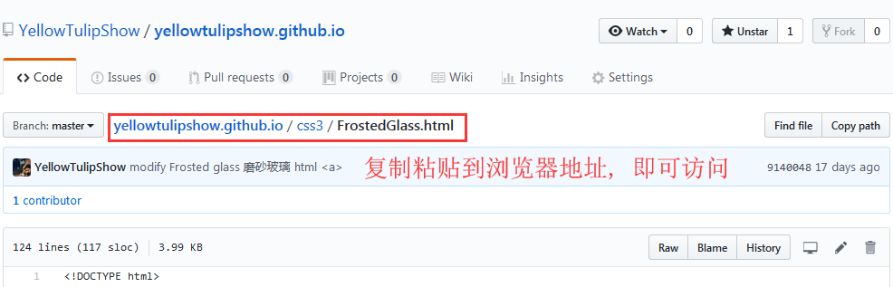

# yellowtulipshow.github.io

> 私人创建的内容, 包括了各种的笔记与实例
>
> 一些生活或学习中的案例分享
>
> 做出来的小游戏, 效果展示等等..
>
> 首页的 index.html 直接跳转到由 [个人站点C#版本代码](https://github.com/YellowTulipShow/YellowTulipShowSystem.CSharp) 创建制作的程序首页

**欢迎来访, 如有问题欢迎 Issues, 或发送给我的个人邮箱: 1426689530@qq.com**


### 注释:

#### 查看目录下的 html 演示效果, 快捷方法:

不愿意搭建模板博客, 不自由, 也懒...


## 参考学习链接:
### 图床
```shell
# 图床 - 百度百科
https://baike.baidu.com/item/图床

# 贴图库
http://www.tietuku.com

# 在线音频 & 视频转换器
https://www.media.io/zh/
```
