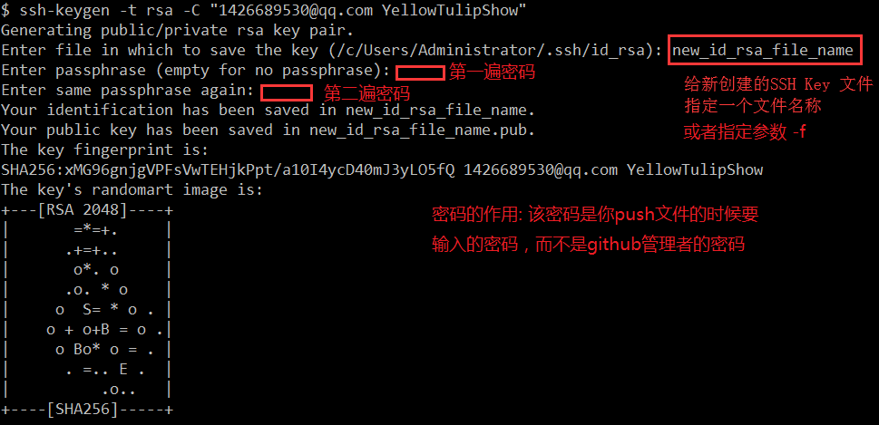

# SSH 配置

## SSH 作用
用于GitHub SSH协议 可以不设置密码


## 创建一个新 SSH Key
```shell
$ ssh-keygen -t rsa -C "<email account>"

# 参数注解:
    -t 指定密钥类型，默认是rsa，可以省略
    -C 设置注释文字，比如邮箱
    -f 指定密钥文件存储文件名 (不指定时, 默认名称是: id_rsa)
```

当然, 红色框部分都可以直接按 Enter 键直接跳过

执行命令结束后在本地创建了两个文件:
* **~/.ssh/id_rsa**
    秘钥文件 不能给人看, 任何人都不行的文件
* **~/.ssh/id_rsa.pub**
    公钥文件 可以用于放置在 GitHub 网站


## 配置 SSH
创建配置文件: `~/config`
```shell
# 配置别名, 只在本地使用时用于区分
Host

# 主机名称 (一般都是服务器域名)
HostName

# 用户名称 (默认git)
User

# 绑定的标识文件路径名称 (重点标识)
IdentityFile
```
配置完成即可, 同时不要在服务器(托管平台)的 SSH 添加设置好对应的公钥文件标识内容

### 测试是否连通
```shell
ssh -T <配置别名Host /或者 服务器域名(github.com)>
```

### 案例: 一台客户机 N个服务器 N个账号
#### 背景:

(标识: `开源`)现有一个 GitHub 账户 用于放置个人的公开开源代码

(标识: `个人`)一个 Gitee 码云账户 用于放置个人的私有代码, 文件之类的

(标识: `工作`)一个 Gitee 码云账户 用于放置工作的私有代码, 小公司, 没有规范集中的代码管理方案地址

(标识: `私活`)一个 Gitee 码云账户 用于放置给朋友开发, 接私活的私有代码地址

绝大部分情况下, 在开发 `私活` 和 `工作` 的时候 需要用到 `开源` 和 `个人` 里面项目的内容, 并且有新想法的时候需要同步更改, 所以需要将代码在一台机器上进编码推送使用

#### 解决:

首先需要为每一个账户创建一个 ssh 秘钥文件并设置别名:
```shell
ssh-keygen -t rsa -C "<email account>" -f id_rsa_开源
ssh-keygen -t rsa -C "<email account>" -f id_rsa_个人
ssh-keygen -t rsa -C "<email account>" -f id_rsa_工作
ssh-keygen -t rsa -C "<email account>" -f id_rsa_私活
```
这里的邮箱账户设为一个也不要紧, 但要跟项目对应提交的作者相同, 我这里因为都是我自己, 所以填写的都一样

创建好 ssh key 之后需要将前面创建好的 ssh key 都放到 `~/.ssh` 目录下

并且检查 `~/.ssh` 目录下 是否有 文件 `config` (没有扩展名) 如果没有创建它

接下来对文件 `config` 写入如下配置:
```shell
# github 开源
Host github-开源
HostName github.com
User git
IdentityFile ~/.ssh/id_rsa_开源

# gitee(码云) 个人
Host gitee-个人
HostName gitee.com
User git
IdentityFile ~/.ssh/id_rsa_个人

# gitee(码云) 工作
Host gitee-工作
HostName gitee.com
User git
IdentityFile ~/.ssh/id_rsa_工作

# gitee(码云) 私活
Host gitee-私活
HostName gitee.com
User git
IdentityFile ~/.ssh/id_rsa_私活
```

`IdentityFile` 字段的内容 就是对应上面创建的 ssh 秘钥文件地址

接下来就需要在各个托管平台的各个账户中 将对应的 ssh 秘钥文件添加进去

详情略过...

这时基本上就配置完了, 接下来就需要理解使用了

首先测试连接 `托管平台` - `账户`是否成功
```shell
ssh -T github-开源
ssh -T gitee-个人
ssh -T gitee-工作
ssh -T gitee-私活
```
注意代码中 `-T` 参数后面的 名称就是在 文件 `config` 的 `Host` 字段填写的值

如果返回的结果, 没报错 而且跟你打招呼了, 那就表明配置成功了, 比如: Hi XXXX ....

这是你需要注意的就是返回的这个 `XXXX` 是不是对应平台对应账户的名称, 根据这个及时调整 账户中的 ssh 秘钥

然后在项目中的 `remote` 配置中需要删除原来的配置信息 `origin` 如果有其他版本库, 自行区分处理

添加新的远程版本库链接: (重点来了)

一般我们在 类似 GitHub 上创建一个空的版本库 或 clone 一个现有的版本库时, 托管平台给我们的地址是类似于这样的:
```shell
git remote add origin git@github.com:账户名/项目名称.git
```

这里我们手动将 `git@github.com` 部分替换为 上面配置的 `Host` 字段值 `github-开源`

然后将新的地址填写的 `remote` 远程版本库的设置中:
```shell
git remote add origin github-开源:账户名/项目名称.git
```

然后因为之前删过了 远程版本库的设置, 需要拉取一下 分支代码的最新情况
```shell
git pull origin
```
即可与原来的项目保持一致

其他的项目如法炮制即可

## 参考学习链接:
```shell
# ssh-keygen 中文手册
http://www.jinbuguo.com/openssh/ssh-keygen.html

# ssh-config配置
https://blog.csdn.net/huasonl88/article/details/52166876

# windows一台电脑添加多个git账号
https://blog.csdn.net/qq1332479771/article/details/70149616

# Git使用手册：HTTPS和SSH方式的区别和使用
https://www.cnblogs.com/lqfxyy/p/5740720.html

# windows下git多账号配置详解
https://jingyan.baidu.com/article/ab69b2708d09382ca7189f9b.html
```
