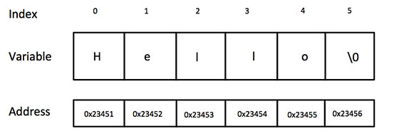

# 基础语法结构

## C的令牌（Tokens）
C 程序由各种令牌组成，令牌可以是关键字、标识符、常量、字符串值，或者是一个符号。例如，下面的 C 语句包括五个令牌：
```c
printf
(
"Hello, World! \n"
)
;
```

## 分号 ;
在 C 程序中，分号是语句结束符。也就是说，每个语句必须以分号结束。它表明一个逻辑实体的结束。

## 注释
```c
// 单行注释

/* 单行注释 */
/*
 多行注释
 多行注释
 多行注释
 */
```
您不能在注释内嵌套注释，注释也不能出现在字符串或字符值中。

## 标识符
C 标识符是用来标识变量、函数，或任何其他用户自定义项目的名称。一个标识符以字母 A-Z 或 a-z 或下划线 _ 开始，后跟零个或多个字母、下划线和数字（0-9）。

C 标识符内不允许出现标点字符，比如 @、$ 和 %。C 是**区分大小写**的编程语言。因此，在 C 中，Manpower 和 manpower 是两个不同的标识符。

下面列出几个有效的标识符：

```
mohd       zara    abc   move_name  a_123
myname50   _temp   j     a23b9      retVal
```

## 关键字
下表列出了 C 中的保留字。这些保留字不能作为常量名、变量名或其他标识符名称。

| 关键字 | 说明 |
| --- | --- |
| auto | 声明自动变量 |
| break | 跳出当前循环 |
| case | 开关语句分支 |
| char | 声明字符型变量或函数返回值类型 |
| const | 声明只读变量 |
| continue | 结束当前循环，开始下一轮循环 |
| default | 开关语句中的"其它"分支 |
| do | 循环语句的循环体 |
| double | 声明双精度浮点型变量或函数返回值类型 |
| else | 条件语句否定分支（与 if 连用） |
| enum | 声明枚举类型 |
| extern | 声明变量或函数是在其它文件或本文件的其他位置定义 |
| float | 声明浮点型变量或函数返回值类型 |
| fo | 一种循环语句 |
| goto | 无条件跳转语句 |
| if | 条件语句 |
| int | 声明整型变量或函数 |
| long | 声明长整型变量或函数返回值类型 |
| register | 声明寄存器变量 |
| return | 子程序返回语句（可以带参数，也可不带参数） |
| short | 声明短整型变量或函数 |
| signed | 声明有符号类型变量或函数 |
| sizeof | 计算数据类型或变量长度（即所占字节数） |
| static | 声明静态变量 |
| struct | 声明结构体类型 |
| switch | 用于开关语句 |
| typedef | 用以给数据类型取别名 |
| unsigned | 声明无符号类型变量或函数 |
| union | 声明共用体类型 |
| void | 声明函数无返回值或无参数，声明无类型指针 |
| volatile | 说明变量在程序执行中可被隐含地改变 |
| while | 循环语句的循环条件 |
| \_Bool | C99 新增关键字 |
| \_Complex | C99 新增关键字 |
| \_Imaginary | C99 新增关键字 |
| inline | C99 新增关键字 |
| restrict | C99 新增关键字 |
| \_Alignas | C11 新增关键字 |
| \_Alignof | C11 新增关键字 |
| \_Atomic | C11 新增关键字 |
| \_Generic | C11 新增关键字 |
| \_Noreturn | C11 新增关键字 |
| \_Static_assert | C11 新增关键字 |
| \_Thread_local | C11 新增关键字 |

## C中的空格
只包含空格的行，被称为空白行，可能带有注释，C 编译器会完全忽略它。

在 C 中，空格用于描述空白符、制表符、换行符和注释。空格分隔语句的各个部分，让编译器能识别语句中的某个元素（比如 int）在哪里结束，下一个元素在哪里开始。

因此，在下面的语句中：
```c
int age;
```
在这里，int 和 age 之间必须至少有一个空格字符（通常是一个空白符），这样编译器才能够区分它们。

## C数据类型
 * **基本类型**
    它们是算术类型，包括两种类型：整数类型和浮点类型。

 * **枚举类型**
    它们也是算术类型，被用来定义在程序中只能赋予其一定的离散整数值的变量。

 * **void 类型**
    类型说明符 void 表明没有可用的值。

 * **派生类型**
    它们包括：指针类型、数组类型、结构类型、共用体类型和函数类型。

数组类型和结构类型统称为聚合类型。函数的类型指的是函数返回值的类型。

### 整数类型

| 类型 | 存储大小 | 值范围 |
| --- | --- | --- |
| char | 1 字节 | -128 到 127 或 0 到 255 |
| unsigned char | 1 字节 | 0 到 255 |
| signed char | 1 字节 | -128 到 127 |
| int | 2 或 4 字节 | -32,768 到 32,767 或 -2,147,483,648 到 2,147,483,647 |
| unsigned int | 2 或 4 字节 | 0 到 65,535 或 0 到 4,294,967,295 |
| short | 2 字节 | -32,768 到 32,767 |
| unsigned short | 2 字节 | 0 到 65,535 |
| long | 4 字节 | -2,147,483,648 到 2,147,483,647 |
| unsigned long | 4 字节 | 0 到 4,294,967,295 |

int，long int，short int的宽度都可能随编译器而异。 但有几条铁定的原则(ANSI/ISO制订的):
* `sizeof(short int) <= sizeof(int)`
* `sizeof(int) <= sizeof(long int)`
* `short int`至少应为16位（2字节）
* `long int`至少应为32位。

为了得到某个类型或某个变量在特定平台上的准确大小，您可以使用 sizeof 运算符。表达式 sizeof(type) 得到对象或类型的存储字节大小。

下面的实例演示了获取 int 类型的大小：

```c
#include <stdio.h>
#include <limits.h>

int main()
{
   printf("int 存储大小 : %lu \n", sizeof(int));
   return 0;
}
```

### 浮点类型
下表列出了关于标准浮点类型的存储大小、值范围和精度的细节：

| 类型 | 存储大小 | 值范围 | 精度 |
| --- | --- | --- | --- |
| float | 4 字节 | 1.2E-38 到 3.4E+38 | 6 位小数 |
| double | 8 字节 | 2.3E-308 到 1.7E+308 | 15 位小数 |
| long double | 16 字节 | 3.4E-4932 到 1.1E+4932 | 19 位小数 |

头文件 `float.h` 定义了宏，在程序中可以使用这些值和其他有关实数二进制表示的细节。

下面的实例将输出浮点类型占用的存储空间以及它的范围值：
```c
#include <stdio.h>
#include <float.h>

int main()
{
   printf("float 存储最大字节数 : %lu \n", sizeof(float));
   printf("float 最小值: %E\n", FLT_MIN );
   printf("float 最大值: %E\n", FLT_MAX );
   printf("精度值: %d\n", FLT_DIG );

   return 0;
}
```
当您在 Linux 上编译并执行上面的程序时，它会产生下列结果：
```
float 存储最大字节数 : 4
float 最小值: 1.175494E-38
float 最大值: 3.402823E+38
精度值: 6
```

### void 类型
void 类型指定没有可用的值。它通常用于以下三种情况下：

* **函数返回为空**
    C 中有各种函数都不返回值，或者您可以说它们返回空。不返回值的函数的返回类型为空。
    例如 void exit (int status);

* **函数参数为空**
    C 中有各种函数不接受任何参数。不带参数的函数可以接受一个 void。
    例如 int rand(void);

* **指针指向 void**
    类型为 void * 的指针代表对象的地址，而不是类型。
    例如，内存分配函数 void \*malloc( size_t size );
    返回指向 void 的指针，可以转换为任何数据类型。

## C变量
变量其实只不过是程序可操作的存储区的名称。C 中每个变量都有特定的类型，类型决定了变量存储的大小和布局，该范围内的值都可以存储在内存中，运算符可应用于变量上。

变量的名称可以由字母、数字和下划线字符组成。它必须以字母或下划线开头。大写字母和小写字母是不同的，因为 C 是大小写敏感的。

有以下几种基本的变量类型：

| 类型 | 描述 |
| --- | --- |
| char | 通常是一个字节（八位）。这是一个整数类型。 |
| int | 对机器而言，整数的最自然的大小。 |
| float | 单精度浮点值。单精度是这样的格式，1位符号，8位指数，23位小数。  |
| double | 双精度浮点值。双精度是1位符号，11位指数，52位小数。  |
| void | 表示类型的缺失。 |

C 语言也允许定义各种其他类型的变量，比如枚举、指针、数组、结构、共用体等等

### C中的变量定义
变量定义就是告诉编译器在何处创建变量的存储，以及如何创建变量的存储。变量定义指定一个数据类型，并包含了该类型的一个或多个变量的列表，如下所示：
```c
type variable_list;
```

在这里，type 必须是一个有效的 C 数据类型，可以是 char、w_char、int、float、double 或任何用户自定义的对象，variable_list 可以由一个或多个标识符名称组成，多个标识符之间用逗号分隔。下面列出几个有效的声明：
```c
int    i, j, k;
char   c, ch;
float  f, salary;
double d;
```

行 int i, j, k; 声明并定义了变量 i、j 和 k，这指示编译器创建类型为 int 的名为 i、j、k 的变量。

变量可以在声明的时候被初始化（指定一个初始值）。初始化器由一个等号，后跟一个常量表达式组成，如下所示：
```c
type variable_name = value;
```

下面列举几个实例：
```c
extern int d = 3, f = 5;    // d 和 f 的声明与初始化
int d = 3, f = 5;           // 定义并初始化 d 和 f
byte z = 22;                // 定义并初始化 z
char x = 'x';               // 变量 x 的值为 'x'
```

不带初始化的定义：带有静态存储持续时间的变量会被隐式初始化为 NULL（所有字节的值都是 0），其他所有变量的初始值是未定义的。

### C中的变量声明

变量声明向编译器保证变量以指定的类型和名称存在，这样编译器在不需要知道变量完整细节的情况下也能继续进一步的编译。变量声明只在编译时有它的意义，在程序连接时编译器需要实际的变量声明。

变量的声明有两种情况：
1. 一种是需要建立存储空间的。例如：int a 在声明的时候就已经建立了存储空间。
2. 另一种是不需要建立存储空间的，通过使用extern关键字声明变量名而不定义它。 例如：extern int a 其中变量 a 可以在别的文件中定义的。
    除非有extern关键字，否则都是变量的定义。

```c
extern int i;   //声明，不是定义
int i;          //声明，也是定义
```

尝试下面的实例，其中，变量在头部就已经被声明，但是定义与初始化在主函数内：

```c
#include <stdio.h>

// 函数外定义变量 x 和 y
int x;
int y;
int addtwonum()
{
    // 函数内声明变量 x 和 y 为外部变量
    extern int x;
    extern int y;
    // 给外部变量（全局变量）x 和 y 赋值
    x = 1;
    y = 2;
    return x+y;
}

int main()
{
    int result;
    // 调用函数 addtwonum
    result = addtwonum();

    printf("result 为: %d",result);
    return 0;
}
```

当上面的代码被编译和执行时，它会产生下列结果：
```
result 为: 3
```

如果需要在一个源文件中引用另外一个源文件中定义的变量，我们只需在引用的文件中将变量加上 extern 关键字的声明即可。

**addtwonum.c 文件代码：**
```c
#include <stdio.h>
/*外部变量声明*/
extern int x ;
extern int y ;
int addtwonum()
{
    return x+y;
}
```

**test.c 文件代码：**
```c
#include <stdio.h>

/*定义两个全局变量*/
int x=1;
int y=2;
int addtwonum();
int main(void)
{
    int result;
    result = addtwonum();
    printf("result 为: %d\n",result);
    return 0;
}
```

当上面的代码被编译和执行时，它会产生下列结果：
```
$ gcc addtwonum.c test.c -o main
$ ./main
result 为: 3
```

### C中的左值（Lvalues）和右值（Rvalues）

C 中有两种类型的表达式：

* **左值（lvalue）**：指向内存位置的表达式被称为左值（lvalue）表达式。左值可以出现在赋值号的左边或右边。
* **右值（rvalue）**：术语右值（rvalue）指的是存储在内存中某些地址的数值。右值是不能对其进行赋值的表达式，也就是说，右值可以出现在赋值号的右边，但不能出现在赋值号的左边。

变量是左值，因此可以出现在赋值号的左边。数值型的字面值是右值，因此不能被赋值，不能出现在赋值号的左边。下面是一个有效的语句：
```c
int g = 20;
```

但是下面这个就不是一个有效的语句，会生成编译时错误：
```c
10 = 20;
```

## C常量

常量是固定值，在程序执行期间不会改变。这些固定的值，又叫做字面量。

常量可以是任何的基本数据类型，比如整数常量、浮点常量、字符常量，或字符串字面值，也有枚举常量。

常量就像是常规的变量，只不过常量的值在定义后不能进行修改。

### 整数常量
整数常量可以是十进制、八进制或十六进制的常量。前缀指定基数：0x 或 0X 表示十六进制，0 表示八进制，不带前缀则默认表示十进制。

整数常量也可以带一个后缀，后缀是 U 和 L 的组合，U 表示无符号整数（unsigned），L 表示长整数（long）。后缀可以是大写，也可以是小写，U 和 L 的顺序任意。

下面列举几个整数常量的实例：
```c
212         /* 合法的 */
215u        /* 合法的 */
0xFeeL      /* 合法的 */
078         /* 非法的：8 不是八进制的数字 */
032UU       /* 非法的：不能重复后缀 */
```

以下是各种类型的整数常量的实例：
```c
85         /* 十进制 */
0213       /* 八进制 */
0x4b       /* 十六进制 */
30         /* 整数 */
30u        /* 无符号整数 */
30l        /* 长整数 */
30ul       /* 无符号长整数 */
```

### 浮点常量
浮点常量由整数部分、小数点、小数部分和指数部分组成。您可以使用小数形式或者指数形式来表示浮点常量。

当使用小数形式表示时，必须包含整数部分、小数部分，或同时包含两者。当使用指数形式表示时， 必须包含小数点、指数，或同时包含两者。带符号的指数是用 e 或 E 引入的。

下面列举几个浮点常量的实例：
```c
3.14159       /* 合法的 */
314159E-5L    /* 合法的 */
510E          /* 非法的：不完整的指数 */
210f          /* 非法的：没有小数或指数 */
.e55          /* 非法的：缺少整数或分数 */
```

### 字符常量
字符常量是括在单引号中，例如，'x' 可以存储在 char 类型的简单变量中。

字符常量可以是一个普通的字符（例如 'x'）、一个转义序列（例如 '\t'），或一个通用的字符（例如 '\u02C0'）。

在 C 中，有一些特定的字符，当它们前面有反斜杠时，它们就具有特殊的含义，被用来表示如换行符（\n）或制表符（\t）等。下表列出了一些这样的转义序列码：

| 转义序列 | 含义 |
| --- | --- |
| \\ | \ 字符 |
| \' | ' 字符 |
| \" | " 字符 |
| \? | ? 字符 |
| \a | 警报铃声 |
| \b | 退格键 |
| \f | 换页符 |
| \n | 换行符 |
| \r | 回车 |
| \t | 水平制表符 |
| \v | 垂直制表符 |
| \ooo | 一到三位的八进制数 |
| \xhh... | 一个或多个数字的十六进制数 |

下面的实例显示了一些转义序列字符：
```c
#include <stdio.h>

int main()
{
   printf("Hello\tWorld\n\n");

   return 0;
}
```

当上面的代码被编译和执行时，它会产生下列结果：
```
Hello   World
```

### 字符串常量
字符串字面值或常量是括在双引号 "" 中的。一个字符串包含类似于字符常量的字符：普通的字符、转义序列和通用的字符。

您可以使用空格做分隔符，把一个很长的字符串常量进行分行。

下面的实例显示了一些字符串常量。下面这三种形式所显示的字符串是相同的。
```
"hello, dear"

"hello, \

dear"

"hello, " "d" "ear"
```

### 定义常量

在 C 中，有两种简单的定义常量的方式：

* 使用 #define 预处理器。
* 使用 const 关键字。

#### #define 预处理器

下面是使用 #define 预处理器定义常量的形式：
```c
#define identifier value
```

具体请看下面的实例：
```c
#include <stdio.h>

#define LENGTH 10
#define WIDTH  5
#define NEWLINE '\n'

int main()
{

   int area;

   area = LENGTH * WIDTH;
   printf("value of area : %d", area);
   printf("%c", NEWLINE);

   return 0;
}
```

当上面的代码被编译和执行时，它会产生下列结果：
```
value of area : 50
```

#### const 关键字

您可以使用 const 前缀声明指定类型的常量，如下所示：
```c
const type variable = value;
```

具体请看下面的实例：
```c
#include <stdio.h>

int main()
{
   const int  LENGTH = 10;
   const int  WIDTH  = 5;
   const char NEWLINE = '\n';
   int area;

   area = LENGTH * WIDTH;
   printf("value of area : %d", area);
   printf("%c", NEWLINE);

   return 0;
}
```

当上面的代码被编译和执行时，它会产生下列结果：
```
value of area : 50
```

请注意，把常量定义为大写字母形式，是一个很好的编程实践。

## C存储类

存储类定义 C 程序中变量/函数的范围（可见性）和生命周期。这些说明符放置在它们所修饰的类型之前。下面列出 C 程序中可用的存储类：
* **auto**
* **register**
* **static**
* **extern**

### auto 存储类
auto 存储类是所有局部变量默认的存储类。
```c
{
   int mount;
   auto int month;
}
```
上面的实例定义了两个带有相同存储类的变量，auto 只能用在函数内，即 auto 只能修饰局部变量。

### register 存储类
register 存储类用于定义存储在寄存器中而不是 RAM 中的局部变量。这意味着变量的最大尺寸等于寄存器的大小（通常是一个词），且不能对它应用一元的 '&' 运算符（因为它没有内存位置）。
```c
{
   register int  miles;
}
```
寄存器只用于需要快速访问的变量，比如计数器。还应注意的是，定义 'register' 并不意味着变量将被存储在寄存器中，它意味着变量可能存储在寄存器中，这取决于硬件和实现的限制。

### static 存储类
static 存储类指示编译器在程序的生命周期内保持局部变量的存在，而不需要在每次它进入和离开作用域时进行创建和销毁。因此，使用 static 修饰局部变量可以在函数调用之间保持局部变量的值。

static 修饰符也可以应用于全局变量。当 static 修饰全局变量时，会使变量的作用域限制在声明它的文件内。

全局声明的一个 static 变量或方法可以被任何函数或方法调用，只要这些方法出现在跟 static 变量或方法同一个文件中。

以下实例演示了 static 修饰全局变量和局部变量的应用：
```c
#include <stdio.h>

/* 函数声明 */
void func1(void);

static int count=10;        /* 全局变量 - static 是默认的 */

int main()
{
  while (count--) {
      func1();
  }
  return 0;
}

void func1(void)
{
/* 'thingy' 是 'func1' 的局部变量 - 只初始化一次
 * 每次调用函数 'func1' 'thingy' 值不会被重置。
 */
  static int thingy = 5;
  thingy++;
  printf(" thingy 为 %d ， count 为 %d\n", thingy, count);
}
```
实例中 count 作为全局变量可以在函数内使用，thingy 使用 static 修饰后，不会在每次调用时重置。
```
thingy 为 6 ， count 为 9
thingy 为 7 ， count 为 8
thingy 为 8 ， count 为 7
thingy 为 9 ， count 为 6
thingy 为 10 ， count 为 5
thingy 为 11 ， count 为 4
thingy 为 12 ， count 为 3
thingy 为 13 ， count 为 2
thingy 为 14 ， count 为 1
thingy 为 15 ， count 为 0
```

### extern 存储类
extern 存储类用于提供一个全局变量的引用，全局变量对所有的程序文件都是可见的。当您使用 extern 时，对于无法初始化的变量，会把变量名指向一个之前定义过的存储位置。

当您有多个文件且定义了一个可以在其他文件中使用的全局变量或函数时，可以在其他文件中使用 extern 来得到已定义的变量或函数的引用。可以这么理解，extern 是用来在另一个文件中声明一个全局变量或函数。

extern 修饰符通常用于当有两个或多个文件共享相同的全局变量或函数的时候，如下所示：

**第一个文件：main.c**
```c
#include <stdio.h>

int count ;
extern void write_extern();

int main()
{
   count = 5;
   write_extern();
}
```

**第二个文件：support.c**
```c
#include <stdio.h>

extern int count;

void write_extern(void)
{
   printf("count is %d\n", count);
}
```

在这里，第二个文件中的 extern 关键字用于声明已经在第一个文件 main.c 中定义的 count。现在 ，编译这两个文件，如下所示：
```shell
$ gcc main.c support.c
```

这会产生 a.out 可执行程序，当程序被执行时，它会产生下列结果：
```
count is 5
```

## C运算符

运算符是一种告诉编译器执行特定的数学或逻辑操作的符号。C 语言内置了丰富的运算符，并提供了以下类型的运算符：
* **算术运算符**
* **关系运算符**
* **逻辑运算符**
* **位运算符**
* **赋值运算符**
* **杂项运算符**

### 算术运算符

下表显示了 C 语言支持的所有算术运算符。

假设变量 A 的值为 10，变量 B 的值为 20，则：

| 运算符 | 描述 | 实例 |
| --- | --- | --- |
| + | 把两个操作数相加 | A + B 将得到 30 |
| - | 从第一个操作数中减去第二个操作数 | A - B 将得到 -10 |
| * | 把两个操作数相乘 | A * B 将得到 200 |
| / | 分子除以分母 | B / A 将得到 2 |
| % | 取模运算符，整除后的余数 | B % A 将得到 0 |
| ++ | 自增运算符，整数值增加 1 | A++ 将得到 11 |
| -- | 自减运算符，整数值减少 1 | A-- 将得到 9 |

了解 C 语言中所有可用的算术运算符：
```c
#include <stdio.h>

int main()
{
   int a = 21;
   int b = 10;
   int c ;

   c = a + b;
   printf("Line 1 - c 的值是 %d\n", c );
   c = a - b;
   printf("Line 2 - c 的值是 %d\n", c );
   c = a * b;
   printf("Line 3 - c 的值是 %d\n", c );
   c = a / b;
   printf("Line 4 - c 的值是 %d\n", c );
   c = a % b;
   printf("Line 5 - c 的值是 %d\n", c );
   c = a++;  // 赋值后再加 1 ，c 为 21，a 为 22
   printf("Line 6 - c 的值是 %d\n", c );
   c = a--;  // 赋值后再减 1 ，c 为 22 ，a 为 21
   printf("Line 7 - c 的值是 %d\n", c );

}
```

当上面的代码被编译和执行时，它会产生下列结果：
```
Line 1 - c 的值是 31
Line 2 - c 的值是 11
Line 3 - c 的值是 210
Line 4 - c 的值是 2
Line 5 - c 的值是 1
Line 6 - c 的值是 21
Line 7 - c 的值是 22
```

以下实例演示了 a++ 与 ++a 的区别：
```c
#include <stdio.h>

int main()
{
   int c;
   int a = 10;
   c = a++;
   printf("先赋值后运算：\n");
   printf("Line 1 - c 的值是 %d\n", c );
   printf("Line 2 - a 的值是 %d\n", a );
   a = 10;
   c = a--;
   printf("Line 3 - c 的值是 %d\n", c );
   printf("Line 4 - a 的值是 %d\n", a );

   printf("先运算后赋值：\n");
   a = 10;
   c = ++a;
   printf("Line 5 - c 的值是 %d\n", c );
   printf("Line 6 - a 的值是 %d\n", a );
   a = 10;
   c = --a;
   printf("Line 7 - c 的值是 %d\n", c );
   printf("Line 8 - a 的值是 %d\n", a );

}
```

以上程序执行输出结果为：

先赋值后运算：
```
Line 1 - c 的值是 10
Line 2 - a 的值是 11
Line 3 - c 的值是 10
Line 4 - a 的值是 9
```
先运算后赋值：
```
Line 5 - c 的值是 11
Line 6 - a 的值是 11
Line 7 - c 的值是 9
Line 8 - a 的值是 9
```

### 关系运算符
下表显示了 C 语言支持的所有关系运算符。假设变量 A 的值为 10，变量 B 的值为 20，则：

| 运算符 | 描述 | 实例 |
| --- | --- | --- |
| == | 检查两个操作数的值是否相等，如果相等则条件为真 | (A == B) 不为真 |
| != | 检查两个操作数的值是否相等，如果不相等则条件为真 | (A != B) 为真 |
| > | 检查左操作数的值是否大于右操作数的值，如果是则条件为真 | (A > B) 不为真 |
| < | 检查左操作数的值是否小于右操作数的值，如果是则条件为真 | (A < B) 为真 |
| >= | 检查左操作数的值是否大于或等于右操作数的值，如果是则条件为真 | (A >= B) 不为真 |
| <= | 检查左操作数的值是否小于或等于右操作数的值，如果是则条件为真 | (A <= B) 为真 |

请看下面的实例，了解 C 语言中所有可用的关系运算符：
```c
#include <stdio.h>

int main()
{
   int a = 21;
   int b = 10;
   int c ;

   if( a == b )
   {
      printf("Line 1 - a 等于 b\n" );
   }
   else
   {
      printf("Line 1 - a 不等于 b\n" );
   }
   if ( a < b )
   {
      printf("Line 2 - a 小于 b\n" );
   }
   else
   {
      printf("Line 2 - a 不小于 b\n" );
   }
   if ( a > b )
   {
      printf("Line 3 - a 大于 b\n" );
   }
   else
   {
      printf("Line 3 - a 不大于 b\n" );
   }
   /* 改变 a 和 b 的值 */
   a = 5;
   b = 20;
   if ( a <= b )
   {
      printf("Line 4 - a 小于或等于 b\n" );
   }
   if ( b >= a )
   {
      printf("Line 5 - b 大于或等于 a\n" );
   }
}
```

当上面的代码被编译和执行时，它会产生下列结果：
```
Line 1 - a 不等于 b
Line 2 - a 不小于 b
Line 3 - a 大于 b
Line 4 - a 小于或等于 b
Line 5 - b 大于或等于 a
```

### 逻辑运算符
下表显示了 C 语言支持的所有关系逻辑运算符。假设变量 A 的值为 1，变量 B 的值为 0，则：

| 运算符 | 描述 | 实例 |
| --- | --- | --- |
| && | 称为逻辑与运算符。如果两个操作数都非零，则条件为真。 | (A && B) 为假。 |
| \|\| | 称为逻辑或运算符。如果两个操作数中有任意一个非零，则条件为真。 | (A \|\| B) 为真。 |
| ! | 称为逻辑非运算符。用来逆转操作数的逻辑状态。如果条件为真则逻辑非运算符将使其为假。 | !(A && B) 为真。 |

请看下面的实例，了解 C 语言中所有可用的逻辑运算符：
```c
#include <stdio.h>

int main()
{
   int a = 5;
   int b = 20;
   int c ;

   if ( a && b )
   {
      printf("Line 1 - 条件为真\n" );
   }
   if ( a || b )
   {
      printf("Line 2 - 条件为真\n" );
   }
   /* 改变 a 和 b 的值 */
   a = 0;
   b = 10;
   if ( a && b )
   {
      printf("Line 3 - 条件为真\n" );
   }
   else
   {
      printf("Line 3 - 条件不为真\n" );
   }
   if ( !(a && b) )
   {
      printf("Line 4 - 条件为真\n" );
   }
}
```
当上面的代码被编译和执行时，它会产生下列结果：
```
Line 1 - 条件为真
Line 2 - 条件为真
Line 3 - 条件不为真
Line 4 - 条件为真
```

### 位运算符
位运算符作用于位，并逐位执行操作。&、 | 和 ^ 的真值表如下所示：

| p | q | p & q | p \| q | p ^ q |
| --- | --- | --- | --- | --- |
| 0 | 0 | 0 | 0 | 0 |
| 0 | 1 | 0 | 1 | 1 |
| 1 | 1 | 1 | 1 | 0 |
| 1 | 0 | 0 | 1 | 1 |

请看下面的实例，了解 C 语言中所有可用的位运算符：
```c
#include <stdio.h>

int main()
{

   unsigned int a = 60;    /* 60 = 0011 1100 */
   unsigned int b = 13;    /* 13 = 0000 1101 */
   int c = 0;

   c = a & b;       /* 12 = 0000 1100 */
   printf("Line 1 - c 的值是 %d\n", c );

   c = a | b;       /* 61 = 0011 1101 */
   printf("Line 2 - c 的值是 %d\n", c );

   c = a ^ b;       /* 49 = 0011 0001 */
   printf("Line 3 - c 的值是 %d\n", c );

   c = ~a;          /*-61 = 1100 0011 */
   printf("Line 4 - c 的值是 %d\n", c );

   c = a << 2;     /* 240 = 1111 0000 */
   printf("Line 5 - c 的值是 %d\n", c );

   c = a >> 2;     /* 15 = 0000 1111 */
   printf("Line 6 - c 的值是 %d\n", c );
}
```

当上面的代码被编译和执行时，它会产生下列结果：
```
Line 1 - c 的值是 12
Line 2 - c 的值是 61
Line 3 - c 的值是 49
Line 4 - c 的值是 -61
Line 5 - c 的值是 240
Line 6 - c 的值是 15
```

### 赋值运算符
下表列出了 C 语言支持的赋值运算符：

| 运算符 | 描述 | 实例 |
| --- | --- | --- |
| = | 简单的赋值运算符，把右边操作数的值赋给左边操作数 | C = A + B 将把 A + B 的值赋给 C |
| \+= | 加且赋值运算符，把右边操作数加上左边操作数的结果赋值给左边操作数 | C += A 相当于 C = C + A |
| \-= | 减且赋值运算符，把左边操作数减去右边操作数的结果赋值给左边操作数 | C -= A 相当于 C = C - A |
| \*= | 乘且赋值运算符，把右边操作数乘以左边操作数的结果赋值给左边操作数 | C \*= A 相当于 C = C * A |
| /= | 除且赋值运算符，把左边操作数除以右边操作数的结果赋值给左边操作数 | C /= A 相当于 C = C / A |
| %= | 求模且赋值运算符，求两个操作数的模赋值给左边操作数 | C %= A 相当于 C = C % A |
| <<= | 左移且赋值运算符 | C <<= 2 等同于 C = C << 2 |
| >>= | 右移且赋值运算符 | C >>= 2 等同于 C = C >> 2 |
| &= | 按位与且赋值运算符 | C &= 2 等同于 C = C & 2 |
| ^= | 按位异或且赋值运算符 | C ^= 2 等同于 C = C ^ 2 |
| \|= | 按位或且赋值运算符 | C \|= 2 等同于 C = C \| 2 |

请看下面的实例，了解 C 语言中所有可用的赋值运算符：
```c
#include <stdio.h>

main()
{
   int a = 21;
   int c ;

   c =  a;
   printf("Line 1 - c=  运算符实例，c 的值 = %d\n", c );

   c +=  a;
   printf("Line 2 - += 运算符实例，c 的值 = %d\n", c );

   c -=  a;
   printf("Line 3 - -= 运算符实例，c 的值 = %d\n", c );

   c *=  a;
   printf("Line 4 - *= 运算符实例，c 的值 = %d\n", c );

   c /=  a;
   printf("Line 5 - /= 运算符实例，c 的值 = %d\n", c );

   c  = 200;
   c %=  a;
   printf("Line 6 - %= 运算符实例，c 的值 = %d\n", c );

   c <<=  2;
   printf("Line 7 - <<= 运算符实例，c 的值 = %d\n", c );

   c >>=  2;
   printf("Line 8 - >>= 运算符实例，c 的值 = %d\n", c );

   c &=  2;
   printf("Line 9 - &= 运算符实例，c 的值 = %d\n", c );

   c ^=  2;
   printf("Line 10 - ^= 运算符实例，c 的值 = %d\n", c );

   c |=  2;
   printf("Line 11 - |= 运算符实例，c 的值 = %d\n", c );
}
```
当上面的代码被编译和执行时，它会产生下列结果：
```
Line 1 - =  运算符实例，c 的值 = 21
Line 2 - += 运算符实例，c 的值 = 42
Line 3 - -= 运算符实例，c 的值 = 21
Line 4 - *= 运算符实例，c 的值 = 441
Line 5 - /= 运算符实例，c 的值 = 21
Line 6 - %= 运算符实例，c 的值 = 11
Line 7 - <<= 运算符实例，c 的值 = 44
Line 8 - >>= 运算符实例，c 的值 = 11
Line 9 - &= 运算符实例，c 的值 = 2
Line 10 - ^= 运算符实例，c 的值 = 0
Line 11 - |= 运算符实例，c 的值 = 2
```

### 杂项运算符 -> sizeof & 三元
下表列出了 C 语言支持的其他一些重要的运算符，包括 sizeof 和 ? :

| 运算符 | 描述 | 实例 |
| --- | --- | --- |
| sizeof() | 返回变量的大小。 | sizeof(a) 将返回 4，其中 a 是整数。 |
| & | 返回变量的地址。 | &a; 将给出变量的实际地址。 |
| \* | 指向一个变量。 | \*a; 将指向一个变量。 |
| ? : | 条件表达式 | 如果条件为真 ? 则值为 X : 否则值为 Y |


请看下面的实例，了解 C 语言中所有可用的杂项运算符：
```c
#include <stdio.h>

int main()
{
   int a = 4;
   short b;
   double c;
   int* ptr;

   /* sizeof 运算符实例 */
   printf("Line 1 - 变量 a 的大小 = %lu\n", sizeof(a) );
   printf("Line 2 - 变量 b 的大小 = %lu\n", sizeof(b) );
   printf("Line 3 - 变量 c 的大小 = %lu\n", sizeof(c) );

   /* & 和 * 运算符实例 */
   ptr = &a;    /* 'ptr' 现在包含 'a' 的地址 */
   printf("a 的值是 %d\n", a);
   printf("*ptr 是 %d\n", *ptr);

   /* 三元运算符实例 */
   a = 10;
   b = (a == 1) ? 20: 30;
   printf( "b 的值是 %d\n", b );

   b = (a == 10) ? 20: 30;
   printf( "b 的值是 %d\n", b );
}
```
当上面的代码被编译和执行时，它会产生下列结果：
```
Line 1 - 变量 a 的大小 = 4
Line 2 - 变量 b 的大小 = 2
Line 3 - 变量 c 的大小 = 8
a 的值是 4
*ptr 是 4
b 的值是 30
b 的值是 20
```

### C中的运算符优先级

运算符的优先级确定表达式中项的组合。这会影响到一个表达式如何计算。某些运算符比其他运算符有更高的优先级，例如，乘除运算符具有比加减运算符更高的优先级。

例如 x = 7 + 3 * 2，在这里，x 被赋值为 13，而不是 20，因为运算符 * 具有比 + 更高的优先级，所以首先计算乘法 3\*2，然后再加上 7。

下表将按运算符优先级从高到低列出各个运算符，具有较高优先级的运算符出现在表格的上面，具有较低优先级的运算符出现在表格的下面。在表达式中，较高优先级的运算符会优先被计算。

| 类别 | 运算符 | 结合性 |
| --- | --- | --- |
| 后缀 | () [] -> . ++ - - | 从左到右 |
| 一元 | + - ! ~ ++ - - (type)* & sizeof | 从右到左 |
| 乘除 | * / % | 从左到右 |
| 加减 | + - | 从左到右 |
| 移位 | << >> | 从左到右 |
| 关系 | < <= > >= | 从左到右 |
| 相等 | == != | 从左到右 |
| 位与 AND | & | 从左到右 |
| 位异或 XOR | ^ | 从左到右 |
| 位或 OR | \| | 从左到右 |
| 逻辑与 AND | && | 从左到右 |
| 逻辑或 OR | \|\| | 从左到右 |
| 条件 | ?: | 从右到左 |
| 赋值 | = += -= \*= /= %=>>= <<= &= ^= |= | 从右到左 |
| 逗号 | , | 从左到右 |

请看下面的实例，了解 C 语言中运算符的优先级：
```c
#include <stdio.h>

main()
{
   int a = 20;
   int b = 10;
   int c = 15;
   int d = 5;
   int e;

   e = (a + b) * c / d;      // ( 30 * 15 ) / 5
   printf("(a + b) * c / d 的值是 %d\n",  e );

   e = ((a + b) * c) / d;    // (30 * 15 ) / 5
   printf("((a + b) * c) / d 的值是 %d\n" ,  e );

   e = (a + b) * (c / d);   // (30) * (15/5)
   printf("(a + b) * (c / d) 的值是 %d\n",  e );

   e = a + (b * c) / d;     //  20 + (150/5)
   printf("a + (b * c) / d 的值是 %d\n" ,  e );

   return 0;
}
```

当上面的代码被编译和执行时，它会产生下列结果：
```
(a + b) * c / d 的值是 90
((a + b) * c) / d 的值是 90
(a + b) * (c / d) 的值是 90
a + (b * c) / d 的值是 50
```

## C判断

判断结构要求程序员指定一个或多个要评估或测试的条件，以及条件为真时要执行的语句（必需的）和条件为假时要执行的语句（可选的）。

C 语言把任何非零和非空的值假定为 true，把零或 null 假定为 false。

下面是大多数编程语言中典型的判断结构的一般形式：


### 判断语句

C 语言提供了以下类型的判断语句。点击链接查看每个语句的细节。

| 语句 | 描述 |
| --- | --- |
| if 语句 | 一个 if 语句 由一个布尔表达式后跟一个或多个语句组成。 |
| if...else 语句 | 一个 if 语句 后可跟一个可选的 else 语句，else 语句在布尔表达式为假时执行。 |
| 嵌套 if 语句 | 您可以在一个 if 或 else if 语句内使用另一个 if 或 else if 语句。 |
| switch 语句 | 一个 switch 语句允许测试一个变量等于多个值时的情况。 |
| 嵌套 switch 语句 | 您可以在一个 switch 语句内使用另一个 switch 语句。 |

### ? : 运算符(三元运算符)

我们已经在前面的章节中讲解了 条件运算符 ? :，可以用来替代 if...else 语句。它的一般形式如下：
```c
Exp1 ? Exp2 : Exp3;
```
其中，Exp1、Exp2 和 Exp3 是表达式。请注意，冒号的使用和位置。

? 表达式的值是由 Exp1 决定的。如果 Exp1 为真，则计算 Exp2 的值，结果即为整个 ? 表达式的值。如果 Exp1 为假，则计算 Exp3 的值，结果即为整个 ? 表达式的值。

### 实例
以下实例通过输入一个数字来判断它是否为奇数或偶数
```c
#include<stdio.h>

int main()
{
    int num;

    printf("输入一个数字 : ");
    scanf("%d",&num);

    (num%2==0)?printf("偶数"):printf("奇数");
}
```

## C循环
有的时候，我们可能需要多次执行同一块代码。

一般情况下，语句是按顺序执行的：函数中的第一个语句先执行，接着是第二个语句，依此类推。

编程语言提供了更为复杂执行路径的多种控制结构。

循环语句允许我们多次执行一个语句或语句组，下面是大多数编程语言中循环语句的流程图：


### 循环类型

C 语言提供了以下几种循环类型。点击链接查看每个类型的细节。

| 循环类型 | 描述 |
| --- | --- |
| while 循环 | 当给定条件为真时，重复语句或语句组。它会在执行循环主体之前测试条件。 |
| for 循环 | 多次执行一个语句序列，简化管理循环变量的代码。 |
| do...while 循环 | 除了它是在循环主体结尾测试条件外，其他与 while 语句类似。 |
| 嵌套循环 | 您可以在 while、for 或 do..while 循环内使用一个或多个循环。 |

### 循环控制语句

循环控制语句改变你代码的执行顺序。通过它你可以实现代码的跳转。

C 提供了下列的循环控制语句。

| 控制语句 | 描述 |
| --- | --- |
| break 语句 | 终止循环或 switch 语句，程序流将继续执行紧接着循环或 switch 的下一条语句。 |
| continue 语句 | 告诉一个循环体立刻停止本次循环迭代，重新开始下次循环迭代。 |
| goto 语句 | 将控制转移到被标记的语句。但是不建议在程序中使用 goto 语句。 |

### 无限循环
如果条件永远不为假，则循环将变成无限循环。for 循环在传统意义上可用于实现无限循环。由于构成循环的三个表达式中任何一个都不是必需的，您可以将某些条件表达式留空来构成一个无限循环。

```c
#include <stdio.h>

int main ()
{
   for( ; ; )
   {
      printf("该循环会永远执行下去！\n");
   }
   return 0;
}
```

当条件表达式不存在时，它被假设为真。您也可以设置一个初始值和增量表达式，但是一般情况下，C 程序员偏向于使用 for(;;) 结构来表示一个无限循环。

* 注意：您可以按 `Ctrl + C` 键终止一个无限循环。

## C函数
函数是一组一起执行一个任务的语句。每个 C 程序都至少有一个函数，即主函数 `main()` ，所有简单的程序都可以定义其他额外的函数。

您可以把代码划分到不同的函数中。如何划分代码到不同的函数中是由您来决定的，但在逻辑上，划分通常是根据每个函数执行一个特定的任务来进行的。

函数声明告诉编译器函数的名称、返回类型和参数。函数定义提供了函数的实际主体。

C 标准库提供了大量的程序可以调用的内置函数。例如，函数 `strcat()` 用来连接两个字符串，函数 `memcpy()` 用来复制内存到另一个位置。

函数还有很多叫法，比如方法、子例程或程序，等等。

### 定义函数

C 语言中的函数定义的一般形式如下：
```c
return_type function_name( parameter list )
{
   body of the function
}
```
在 C 语言中，函数由一个函数头和一个函数主体组成。下面列出一个函数的所有组成部分：

* **返回类型**：一个函数可以返回一个值。return_type 是函数返回的值的数据类型。有些函数执行所需的操作而不返回值，在这种情况下，return_type 是关键字 void。
* **函数名称**：这是函数的实际名称。函数名和参数列表一起构成了函数签名。
* **参数**：参数就像是占位符。当函数被调用时，您向参数传递一个值，这个值被称为实际参数。参数列表包括函数参数的类型、顺序、数量。参数是可选的，也就是说，函数可能不包含参数。
* **函数主体**：函数主体包含一组定义函数执行任务的语句。

### 实例
以下是 max() 函数的源代码。该函数有两个参数 num1 和 num2，会返回这两个数中较大的那个数：
```c
/* 函数返回两个数中较大的那个数 */
int max(int num1, int num2)
{
   /* 局部变量声明 */
   int result;

   if (num1 > num2)
      result = num1;
   else
      result = num2;

   return result;
}
```

### 函数声明

函数声明会告诉编译器函数名称及如何调用函数。函数的实际主体可以单独定义。

函数声明包括以下几个部分：
```c
return_type function_name( parameter list );
```

针对上面定义的函数 max()，以下是函数声明：
```c
int max(int num1, int num2);
```

在函数声明中，参数的名称并不重要，只有参数的类型是必需的，因此下面也是有效的声明：
```c
int max(int, int);
```

当您在一个源文件中定义函数且在另一个文件中调用函数时，函数声明是必需的。在这种情况下，您应该在调用函数的文件顶部声明函数。
调用函数

创建 C 函数时，会定义函数做什么，然后通过调用函数来完成已定义的任务。

当程序调用函数时，程序控制权会转移给被调用的函数。被调用的函数执行已定义的任务，当函数的返回语句被执行时，或到达函数的结束括号时，会把程序控制权交还给主程序。

调用函数时，传递所需参数，如果函数返回一个值，则可以存储返回值。例如：
```c
#include <stdio.h>

/* 函数声明 */
int max(int num1, int num2);

int main ()
{
   /* 局部变量定义 */
   int a = 100;
   int b = 200;
   int ret;

   /* 调用函数来获取最大值 */
   ret = max(a, b);

   printf( "Max value is : %d\n", ret );

   return 0;
}

/* 函数返回两个数中较大的那个数 */
int max(int num1, int num2)
{
   /* 局部变量声明 */
   int result;

   if (num1 > num2)
      result = num1;
   else
      result = num2;

   return result;
}
```

把 max() 函数和 main() 函数放一块，编译源代码。当运行最后的可执行文件时，会产生下列结果：
```
Max value is : 200
```

### 函数参数

如果函数要使用参数，则必须声明接受参数值的变量。这些变量称为函数的形式参数。

形式参数就像函数内的其他局部变量，在进入函数时被创建，退出函数时被销毁。

当调用函数时，有两种向函数传递参数的方式：

| 调用类型 | 描述 |
| --- | --- |
| 传值调用 | 该方法把参数的实际值复制给函数的形式参数。在这种情况下，修改函数内的形式参数不会影响实际参数。 |
| 引用调用 | 通过指针传递方式，形参为指向实参地址的指针，当对形参的指向操作时，就相当于对实参本身进行的操作。 |

默认情况下，C 使用传值调用来传递参数。一般来说，这意味着函数内的代码不能改变用于调用函数的实际参数。

## 作用域规则
任何一种编程中，作用域是程序中定义的变量所存在的区域，超过该区域变量就不能被访问。C 语言中有三个地方可以声明变量：

1. 在函数或块内部的局部变量
2. 在所有函数外部的全局变量
3. 在形式参数的函数参数定义中

让我们来看看什么是局部变量、全局变量和形式参数。

### 局部变量
在某个函数或块的内部声明的变量称为局部变量。它们只能被该函数或该代码块内部的语句使用。局部变量在函数外部是不可知的。下面是使用局部变量的实例。在这里，所有的变量 a、b 和 c 是 main() 函数的局部变量。

```c
#include <stdio.h>

int main ()
{
  /* 局部变量声明 */
  int a, b;
  int c;

  /* 实际初始化 */
  a = 10;
  b = 20;
  c = a + b;

  printf ("value of a = %d, b = %d and c = %d\n", a, b, c);

  return 0;
}
```

### 全局变量
全局变量是定义在函数外部，通常是在程序的顶部。全局变量在整个程序生命周期内都是有效的，在任意的函数内部能访问全局变量。

全局变量可以被任何函数访问。也就是说，全局变量在声明后整个程序中都是可用的。下面是使用全局变量和局部变量的实例：

```c
#include <stdio.h>

/* 全局变量声明 */
int g;

int main ()
{
  /* 局部变量声明 */
  int a, b;

  /* 实际初始化 */
  a = 10;
  b = 20;
  g = a + b;

  printf ("value of a = %d, b = %d and g = %d\n", a, b, g);

  return 0;
}
```

在程序中，局部变量和全局变量的名称可以相同，但是在函数内，如果两个名字相同，会使用局部变量值，全局变量不会被使用。

下面是一个实例： 在程序中，局部变量和全局变量的
```c
#include <stdio.h>

/* 全局变量声明 */
int g = 20;

int main ()
{
  /* 局部变量声明 */
  int g = 10;

  printf ("value of g = %d\n",  g);

  return 0;
}
```

当上面的代码被编译和执行时，它会产生下列结果：
```
value of g = 10
```

### 形式参数
函数的参数，形式参数，被当作该函数内的局部变量，如果与全局变量同名它们会优先使用。下面是一个实例：

```c
#include <stdio.h>

/* 全局变量声明 */
int a = 20;

int main ()
{
  /* 在主函数中的局部变量声明 */
  int a = 10;
  int b = 20;
  int c = 0;
  int sum(int, int);

  printf ("value of a in main() = %d\n",  a);
  c = sum( a, b);
  printf ("value of c in main() = %d\n",  c);

  return 0;
}

/* 添加两个整数的函数 */
int sum(int a, int b)
{
    printf ("value of a in sum() = %d\n",  a);
    printf ("value of b in sum() = %d\n",  b);

    return a + b;
}
```

当上面的代码被编译和执行时，它会产生下列结果：
```
value of a in main() = 10
value of a in sum() = 10
value of b in sum() = 20
value of c in main() = 30
```

### 全局变量与局部变量在内存中的区别：

* 全局变量保存在内存的全局存储区中，占用静态的存储单元；
* 局部变量保存在栈中，只有在所在函数被调用时才动态地为变量分配存储单元。

### 初始化局部变量和全局变量
当局部变量被定义时，系统不会对其初始化，您必须自行对其初始化。定义全局变量时，系统会自动对其初始化，如下所示：

| 数据类型 | 初始化默认值 |
| --- | --- |
| int | 0 |
| char | '\0' |
| float | 0 |
| double | 0 |
| pointer | NULL |

正确地初始化变量是一个良好的编程习惯，否则有时候程序可能会产生意想不到的结果，因为未初始化的变量会导致一些在内存位置中已经可用的垃圾值。

## 数组
C 语言支持数组数据结构，它可以存储一个固定大小的相同类型元素的顺序集合。数组是用来存储一系列数据，但它往往被认为是一系列相同类型的变量。

数组的声明并不是声明一个个单独的变量，比如 number0、number1、...、number99，而是声明一个数组变量，比如 numbers，然后使用 numbers[0]、numbers[1]、...、numbers[99] 来代表一个个单独的变量。数组中的特定元素可以通过索引访问。

所有的数组都是由连续的内存位置组成。最低的地址对应第一个元素，最高的地址对应最后一个元素。


### 声明数组

在 C 中要声明一个数组，需要指定元素的类型和元素的数量，如下所示：
```c
type arrayName [ arraySize ];
```

这叫做一维数组。arraySize 必须是一个大于零的整数常量，type 可以是任意有效的 C 数据类型。例如，要声明一个类型为 double 的包含 10 个元素的数组 balance，声明语句如下：
```c
double balance[10];
```

现在 balance 是一个可用的数组，可以容纳 10 个类型为 double 的数字。

### 初始化数组

在 C 中，您可以逐个初始化数组，也可以使用一个初始化语句，如下所示：
```c
double balance[5] = {1000.0, 2.0, 3.4, 7.0, 50.0};
```

大括号 { } 之间的值的数目不能大于我们在数组声明时在方括号 [ ] 中指定的元素数目。

如果您省略掉了数组的大小，数组的大小则为初始化时元素的个数。因此，如果：
```c
double balance[] = {1000.0, 2.0, 3.4, 7.0, 50.0};
```

您将创建一个数组，它与前一个实例中所创建的数组是完全相同的。下面是一个为数组中某个元素赋值的实例：
```c
balance[4] = 50.0;
```

上述的语句把数组中第五个元素的值赋为 50.0。所有的数组都是以 0 作为它们第一个元素的索引，也被称为基索引，数组的最后一个索引是数组的总大小减去 1。以下是上面所讨论的数组的的图形表示：


### 访问数组元素

数组元素可以通过数组名称加索引进行访问。元素的索引是放在方括号内，跟在数组名称的后边。例如：
```c
double salary = balance[9];
```

上面的语句将把数组中第 10 个元素的值赋给 salary 变量。下面的实例使用了上述的三个概念，即，声明数组、数组赋值、访问数组：
```c
#include <stdio.h>

int main ()
{
   int n[ 10 ]; /* n 是一个包含 10 个整数的数组 */
   int i,j;

   /* 初始化数组元素 */
   for ( i = 0; i < 10; i++ )
   {
      n[ i ] = i + 100; /* 设置元素 i 为 i + 100 */
   }

   /* 输出数组中每个元素的值 */
   for (j = 0; j < 10; j++ )
   {
      printf("Element[%d] = %d\n", j, n[j] );
   }

   return 0;
}
```

当上面的代码被编译和执行时，它会产生下列结果：
```
Element[0] = 100
Element[1] = 101
Element[2] = 102
Element[3] = 103
Element[4] = 104
Element[5] = 105
Element[6] = 106
Element[7] = 107
Element[8] = 108
Element[9] = 109
```

### C 中数组详解

在 C 中，数组是非常重要的，我们需要了解更多有关数组的细节。下面列出了 C 程序员必须清楚的一些与数组相关的重要概念：

| 概念 | 描述 |
| --- | --- |
| 多维数组 | C 支持多维数组。多维数组最简单的形式是二维数组。 |
| 传递数组给函数 | 您可以通过指定不带索引的数组名称来给函数传递一个指向数组的指针。 |
| 从函数返回数组 | C 允许从函数返回数组。 |
| 指向数组的指针 | 您可以通过指定不带索引的数组名称来生成一个指向数组中第一个元素的指针。 |


### enum(枚举)
枚举是 C 语言中的一种基本数据类型，它可以让数据更简洁，更易读。

枚举语法定义格式为：
```c
enum　枚举名　{枚举元素1,枚举元素2,……};
```

接下来我们举个例子，比如：一星期有 7 天，如果不用枚举，我们需要使用 #define 来为每个整数定义一个别名：
```c
#define MON  1
#define TUE  2
#define WED  3
#define THU  4
#define FRI  5
#define SAT  6
#define SUN  7
```

这个看起来代码量就比较多，接下来我们看看使用枚举的方式：
```c
enum DAY
{
      MON=1, TUE, WED, THU, FRI, SAT, SUN
};
```

这样看起来是不是更简洁了。

* 注意：第一个枚举成员的默认值为整型的 0，后续枚举成员的值在前一个成员上加 1。我们在这个实例中把第一个枚举成员的值定义为 1，第二个就为 2，以此类推。

可以在定义枚举类型时改变枚举元素的值：
```c
enum season {spring, summer=3, autumn, winter};
```

没有指定值的枚举元素，其值为前一元素加 1。也就说 spring 的值为 0，summer 的值为 3，autumn 的值为 4，winter 的值为 5

### 枚举变量的定义

前面我们只是声明了枚举类型，接下来我们看看如何定义枚举变量。

我们可以通过以下三种方式来定义枚举变量

1. 先定义枚举类型，再定义枚举变量
```c
enum DAY
{
      MON=1, TUE, WED, THU, FRI, SAT, SUN
};
enum DAY day;
```

2. 定义枚举类型的同时定义枚举变量
```c
enum DAY
{
      MON=1, TUE, WED, THU, FRI, SAT, SUN
} day;
```

3. 省略枚举名称，直接定义枚举变量
```c
enum
{
      MON=1, TUE, WED, THU, FRI, SAT, SUN
} day;
```

### 实例
```c
#include<stdio.h>

enum DAY
{
      MON=1, TUE, WED, THU, FRI, SAT, SUN
};

int main()
{
    enum DAY day;
    day = WED;
    printf("%d",day);
    return 0;
}
```

以上实例输出结果为：
```
3
```

### 枚举遍历
在C 语言中，枚举类型是被当做 int 或者 unsigned int 类型来处理的，所以按照 C 语言规范是没有办法遍历枚举类型的。

不过在一些特殊的情况下，枚举类型必须连续是可以实现有条件的遍历。

以下实例使用 for 来遍历枚举的元素：
```c
#include<stdio.h>

enum DAY
{
      MON=1, TUE, WED, THU, FRI, SAT, SUN
} day;
int main()
{
    // 遍历枚举元素
    for (day = MON; day <= SUN; day++) {
        printf("枚举元素：%d \n", day);
    }
}
```

以上实例输出结果为：
```
枚举元素：1
枚举元素：2
枚举元素：3
枚举元素：4
枚举元素：5
枚举元素：6
枚举元素：7
```

以下枚举类型不连续，这种枚举无法遍历。

```c
enum
{
    ENUM_0,
    ENUM_10 = 10,
    ENUM_11
};
```

枚举在 switch 中的使用：
```c
#include <stdio.h>
#include <stdlib.h>
int main()
{

    enum color { red=1, green, blue };

    enum  color favorite_color;

    /* ask user to choose color */
    printf("请输入你喜欢的颜色: (1. red, 2. green, 3. blue): ");
    scanf("%d", &favorite_color);

    /* 输出结果 */
    switch (favorite_color)
    {
    case red:
        printf("你喜欢的颜色是红色");
        break;
    case green:
        printf("你喜欢的颜色是绿色");
        break;
    case blue:
        printf("你喜欢的颜色是蓝色");
        break;
    default:
        printf("你没有选择你喜欢的颜色");
    }

    return 0;
}
```

以上实例输出结果为：
```
请输入你喜欢的颜色: (1. red, 2. green, 3. blue): 1
你喜欢的颜色是红色
```

### 将整数转换为枚举
以下实例将整数转换为枚举：
```c
#include <stdio.h>
#include <stdlib.h>

int main()
{

    enum day
    {
        saturday,
        sunday,
        monday,
        tuesday,
        wednesday,
        thursday,
        friday
    } workday;

    int a = 1;
    enum day weekend;
    weekend = ( enum day ) a;  //类型转换
    //weekend = a; //错误
    printf("weekend:%d",weekend);
    return 0;
}
```

以上实例输出结果为：
```
weekend:1
```

## C指针
学习 C 语言的指针既简单又有趣。通过指针，可以简化一些 C 编程任务的执行，还有一些任务，如动态内存分配，没有指针是无法执行的。所以，想要成为一名优秀的 C 程序员，学习指针是很有必要的。

正如您所知道的，每一个变量都有一个内存位置，每一个内存位置都定义了可使用连字号（&）运算符访问的地址，它表示了在内存中的一个地址。请看下面的实例，它将输出定义的变量地址：
```c
#include <stdio.h>

int main ()
{
   int  var1;
   char var2[10];

   printf("var1 变量的地址： %p\n", &var1  );
   printf("var2 变量的地址： %p\n", &var2  );

   return 0;
}
```

当上面的代码被编译和执行时，它会产生下列结果：
```
var1 变量的地址： 0x7fff5cc109d4
var2 变量的地址： 0x7fff5cc109de
```

通过上面的实例，我们了解了什么是内存地址以及如何访问它。接下来让我们看看什么是指针。

### 什么是指针？

指针是一个变量，其值为另一个变量的地址，即，内存位置的直接地址。就像其他变量或常量一样，您必须在使用指针存储其他变量地址之前，对其进行声明。指针变量声明的一般形式为：
```c
type *var-name;
```

在这里，type 是指针的基类型，它必须是一个有效的 C 数据类型，var-name 是指针变量的名称。用来声明指针的星号 * 与乘法中使用的星号是相同的。但是，在这个语句中，星号是用来指定一个变量是指针。以下是有效的指针声明：
```c
int    *ip;    /* 一个整型的指针 */
double *dp;    /* 一个 double 型的指针 */
float  *fp;    /* 一个浮点型的指针 */
char   *ch;     /* 一个字符型的指针 */
```

所有实际数据类型，不管是整型、浮点型、字符型，还是其他的数据类型，对应指针的值的类型都是一样的，都是一个代表内存地址的长的十六进制数。

不同数据类型的指针之间唯一的不同是，指针所指向的变量或常量的数据类型不同。
如何使用指针？

使用指针时会频繁进行以下几个操作：定义一个指针变量、把变量地址赋值给指针、访问指针变量中可用地址的值。这些是通过使用一元运算符 * 来返回位于操作数所指定地址的变量的值。下面的实例涉及到了这些操作：
```c
#include <stdio.h>

int main ()
{
   int  var = 20;   /* 实际变量的声明 */
   int  *ip;        /* 指针变量的声明 */

   ip = &var;  /* 在指针变量中存储 var 的地址 */

   printf("Address of var variable: %p\n", &var  );

   /* 在指针变量中存储的地址 */
   printf("Address stored in ip variable: %p\n", ip );

   /* 使用指针访问值 */
   printf("Value of *ip variable: %d\n", *ip );

   return 0;
}
```
当上面的代码被编译和执行时，它会产生下列结果：
```
Address of var variable: bffd8b3c
Address stored in ip variable: bffd8b3c
Value of *ip variable: 20
```

### C中的 NULL 指针

在变量声明的时候，如果没有确切的地址可以赋值，为指针变量赋一个 NULL 值是一个良好的编程习惯。赋为 NULL 值的指针被称为空指针。

NULL 指针是一个定义在标准库中的值为零的常量。请看下面的程序：
```c
#include <stdio.h>

int main ()
{
   int  *ptr = NULL;

   printf("ptr 的地址是 %p\n", ptr  );

   return 0;
}
```

当上面的代码被编译和执行时，它会产生下列结果：
```
ptr 的地址是 0x0
```

在大多数的操作系统上，程序不允许访问地址为 0 的内存，因为该内存是操作系统保留的。然而，内存地址 0 有特别重要的意义，它表明该指针不指向一个可访问的内存位置。但按照惯例，如果指针包含空值（零值），则假定它不指向任何东西。

如需检查一个空指针，您可以使用 if 语句，如下所示：
```c
if(ptr)     /* 如果 p 非空，则完成 */
if(!ptr)    /* 如果 p 为空，则完成 */
```

## 函数指针
函数指针是指向函数的指针变量。

通常我们说的指针变量是指向一个整型、字符型或数组等变量，而函数指针是指向函数。

函数指针可以像一般函数一样，用于调用函数、传递参数。

函数指针变量的声明：
```c
typedef int (*fun_ptr)(int,int); // 声明一个指向同样参数、返回值的函数指针类型
```

以下实例声明了函数指针变量 p，指向函数 max：
```c
#include <stdio.h>

int max(int x, int y)
{
    return x > y ? x : y;
}

int main(void)
{
    /* p 是函数指针 */
    int (* p)(int, int) = & max; // &可以省略
    int a, b, c, d;

    printf("请输入三个数字:");
    scanf("%d %d %d", & a, & b, & c);

    /* 与直接调用函数等价，d = max(max(a, b), c) */
    d = p(p(a, b), c);

    printf("最大的数字是: %d\n", d);

    return 0;
}
```

编译执行，输出结果如下：
```
请输入三个数字:1 2 3
最大的数字是: 3
```

## 回调函数
函数指针作为某个函数的参数

函数指针变量可以作为某个函数的参数来使用的，回调函数就是一个通过函数指针调用的函数。

简单讲：回调函数是由别人的函数执行时调用你实现的函数。

    以下是来自知乎作者常溪玲的解说：

    你到一个商店买东西，刚好你要的东西没有货，于是你在店员那里留下了你的电话，过了几天店里有货了，店员就打了你的电话，然后你接到电话后就到店里去取了货。在这个例子里，你的电话号码就叫回调函数，你把电话留给店员就叫登记回调函数，店里后来有货了叫做触发了回调关联的事件，店员给你打电话叫做调用回调函数，你到店里去取货叫做响应回调事件。

### 实例

实例中 populate_array 函数定义了三个参数，其中第三个参数是函数的指针，通过该函数来设置数组的值。

实例中我们定义了回调函数 `getNextRandomValue`，它返回一个随机值，它作为一个函数指针传递给 `populate_array` 函数。

`populate_array` 将调用 10 次回调函数，并将回调函数的返回值赋值给数组。
```c
#include <stdlib.h>
#include <stdio.h>

// 回调函数
void populate_array(int *array, size_t arraySize, int (*getNextValue)(void))
{
    for (size_t i=0; i<arraySize; i++)
        array[i] = getNextValue();
}

// 获取随机值
int getNextRandomValue(void)
{
    return rand();
}

int main(void)
{
    int myarray[10];
    populate_array(myarray, 10, getNextRandomValue);
    for(int i = 0; i < 10; i++) {
        printf("%d ", myarray[i]);
    }
    printf("\n");
    return 0;
}
```

编译执行，输出结果如下：
```
16807 282475249 1622650073 984943658 1144108930 470211272 101027544 1457850878 1458777923 2007237709
```

## C字符串
在 C 语言中，字符串实际上是使用 null 字符 '\0' 终止的一维字符数组。因此，一个以 null 结尾的字符串，包含了组成字符串的字符。

下面的声明和初始化创建了一个 "Hello" 字符串。由于在数组的末尾存储了空字符，所以字符数组的大小比单词 "Hello" 的字符数多一个。
```c
char greeting[6] = {'H', 'e', 'l', 'l', 'o', '\0'};
```

依据数组初始化规则，您可以把上面的语句写成以下语句：
```c
char greeting[] = "Hello";
```

以下是 C/C++ 中定义的字符串的内存表示：


其实，您不需要把 null 字符放在字符串常量的末尾。C 编译器会在初始化数组时，自动把 '\0' 放在字符串的末尾。让我们尝试输出上面的字符串：
```c
#include <stdio.h>

int main ()
{
   char greeting[6] = {'H', 'e', 'l', 'l', 'o', '\0'};

   printf("Greeting message: %s\n", greeting );

   return 0;
}
```

当上面的代码被编译和执行时，它会产生下列结果：
```
Greeting message: Hello
```

C 中有大量操作字符串的函数：

| 函数 | 作用 |
| --- | --- |
| strcpy(s1, s2); | 复制字符串 s2 到字符串 s1。 |
| strcat(s1, s2); | 连接字符串 s2 到字符串 s1 的末尾。 |
| strlen(s1); | 返回字符串 s1 的长度。 |
| strcmp(s1, s2); | 如果 s1 和 s2 是相同的，则返回 0；如果 s1<s2 则返回小于 0；如果 s1>s2 则返回大于 0。 |
| strchr(s1, ch); | 返回一个指针，指向字符串 s1 中字符 ch 的第一次出现的位置。 |
| strstr(s1, s2); | 返回一个指针，指向字符串 s1 中字符串 s2 的第一次出现的位置。 |

下面的实例使用了上述的一些函数：
```c
#include <stdio.h>
#include <string.h>

int main ()
{
   char str1[12] = "Hello";
   char str2[12] = "World";
   char str3[12];
   int  len ;

   /* 复制 str1 到 str3 */
   strcpy(str3, str1);
   printf("strcpy( str3, str1) :  %s\n", str3 );

   /* 连接 str1 和 str2 */
   strcat( str1, str2);
   printf("strcat( str1, str2):   %s\n", str1 );

   /* 连接后，str1 的总长度 */
   len = strlen(str1);
   printf("strlen(str1) :  %d\n", len );

   return 0;
}
```

当上面的代码被编译和执行时，它会产生下列结果：
```c
strcpy( str3, str1) :  Hello
strcat( str1, str2):   HelloWorld
strlen(str1) :  10
```

您可以在 C 标准库中找到更多字符串相关的函数。

## C结构体
C 数组允许定义可存储相同类型数据项的变量，结构是 C 编程中另一种用户自定义的可用的数据类型，它允许您存储不同类型的数据项。

结构用于表示一条记录，假设您想要跟踪图书馆中书本的动态，您可能需要跟踪每本书的下列属性：

* Title
* Author
* Subject
* Book ID

### 定义结构

为了定义结构，您必须使用 struct 语句。struct 语句定义了一个包含多个成员的新的数据类型，struct 语句的格式如下：
```c
struct tag {
    member-list
    member-list
    member-list
    ...
} variable-list ;
```

**`tag`** 是结构体标签。

**`member-list`** 是标准的变量定义，比如 int i; 或者 float f，或者其他有效的变量定义。

**`variable-list`** 结构变量，定义在结构的末尾，最后一个分号之前，您可以指定一个或多个结构变量。下面是声明 Book 结构的方式：
```c
struct Books
{
   char  title[50];
   char  author[50];
   char  subject[100];
   int   book_id;
} book;
```

在一般情况下，**`tag`**、**`member-list`**、**`variable-list`** 这 3 部分至少要出现 2 个。以下为实例：
```c
//此声明声明了拥有3个成员的结构体，分别为整型的a，字符型的b和双精度的c
//同时又声明了结构体变量s1
//这个结构体并没有标明其标签
struct
{
    int a;
    char b;
    double c;
} s1;

//此声明声明了拥有3个成员的结构体，分别为整型的a，字符型的b和双精度的c
//结构体的标签被命名为SIMPLE,没有声明变量
struct SIMPLE
{
    int a;
    char b;
    double c;
};
//用SIMPLE标签的结构体，另外声明了变量t1、t2、t3
struct SIMPLE t1, t2[20], *t3;

//也可以用typedef创建新类型
typedef struct
{
    int a;
    char b;
    double c;
} Simple2;
//现在可以用Simple2作为类型声明新的结构体变量
Simple2 u1, u2[20], *u3;
```

在上面的声明中，第一个和第二声明被编译器当作两个完全不同的类型，即使他们的成员列表是一样的，如果令 t3=&s1，则是非法的。

结构体的成员可以包含其他结构体，也可以包含指向自己结构体类型的指针，而通常这种指针的应用是为了实现一些更高级的数据结构如链表和树等。
```c
//此结构体的声明包含了其他的结构体
struct COMPLEX
{
    char string[100];
    struct SIMPLE a;
};

//此结构体的声明包含了指向自己类型的指针
struct NODE
{
    char string[100];
    struct NODE *next_node;
};
```

如果两个结构体互相包含，则需要对其中一个结构体进行不完整声明，如下所示：
```c
struct B;    //对结构体B进行不完整声明

//结构体A中包含指向结构体B的指针
struct A
{
    struct B *partner;
    //other members;
};

//结构体B中包含指向结构体A的指针，在A声明完后，B也随之进行声明
struct B
{
    struct A *partner;
    //other members;
};
```

### 结构体变量的初始化

和其它类型变量一样，对结构体变量可以在定义时指定初始值。
```c
#include <stdio.h>

struct Books
{
   char  title[50];
   char  author[50];
   char  subject[100];
   int   book_id;
} book = {"C 语言", "RUNOOB", "编程语言", 123456};

int main()
{
    printf("title : %s\nauthor: %s\nsubject: %s\nbook_id: %d\n", book.title, book.author, book.subject, book.book_id);
}
```

执行输出结果为：
```
title : C 语言
author: RUNOOB
subject: 编程语言
book_id: 123456
```

### 访问结构成员
为了访问结构的成员，我们使用成员访问运算符（.）。成员访问运算符是结构变量名称和我们要访问的结构成员之间的一个句号。您可以使用 struct 关键字来定义结构类型的变量。下面的实例演示了结构的用法：
```c
#include <stdio.h>
#include <string.h>

struct Books
{
   char  title[50];
   char  author[50];
   char  subject[100];
   int   book_id;
};

int main( )
{
   struct Books Book1;        /* 声明 Book1，类型为 Books */
   struct Books Book2;        /* 声明 Book2，类型为 Books */

   /* Book1 详述 */
   strcpy( Book1.title, "C Programming");
   strcpy( Book1.author, "Nuha Ali");
   strcpy( Book1.subject, "C Programming Tutorial");
   Book1.book_id = 6495407;

   /* Book2 详述 */
   strcpy( Book2.title, "Telecom Billing");
   strcpy( Book2.author, "Zara Ali");
   strcpy( Book2.subject, "Telecom Billing Tutorial");
   Book2.book_id = 6495700;

   /* 输出 Book1 信息 */
   printf( "Book 1 title : %s\n", Book1.title);
   printf( "Book 1 author : %s\n", Book1.author);
   printf( "Book 1 subject : %s\n", Book1.subject);
   printf( "Book 1 book_id : %d\n", Book1.book_id);

   /* 输出 Book2 信息 */
   printf( "Book 2 title : %s\n", Book2.title);
   printf( "Book 2 author : %s\n", Book2.author);
   printf( "Book 2 subject : %s\n", Book2.subject);
   printf( "Book 2 book_id : %d\n", Book2.book_id);

   return 0;
}
```

当上面的代码被编译和执行时，它会产生下列结果：
```
Book 1 title : C Programming
Book 1 author : Nuha Ali
Book 1 subject : C Programming Tutorial
Book 1 book_id : 6495407
Book 2 title : Telecom Billing
Book 2 author : Zara Ali
Book 2 subject : Telecom Billing Tutorial
Book 2 book_id : 6495700
```

### 结构作为函数参数
您可以把结构作为函数参数，传参方式与其他类型的变量或指针类似。您可以使用上面实例中的方式来访问结构变量：
```c
#include <stdio.h>
#include <string.h>

struct Books
{
   char  title[50];
   char  author[50];
   char  subject[100];
   int   book_id;
};

/* 函数声明 */
void printBook( struct Books book );
int main( )
{
   struct Books Book1;        /* 声明 Book1，类型为 Books */
   struct Books Book2;        /* 声明 Book2，类型为 Books */

   /* Book1 详述 */
   strcpy( Book1.title, "C Programming");
   strcpy( Book1.author, "Nuha Ali");
   strcpy( Book1.subject, "C Programming Tutorial");
   Book1.book_id = 6495407;

   /* Book2 详述 */
   strcpy( Book2.title, "Telecom Billing");
   strcpy( Book2.author, "Zara Ali");
   strcpy( Book2.subject, "Telecom Billing Tutorial");
   Book2.book_id = 6495700;

   /* 输出 Book1 信息 */
   printBook( Book1 );

   /* 输出 Book2 信息 */
   printBook( Book2 );

   return 0;
}
void printBook( struct Books book )
{
   printf( "Book title : %s\n", book.title);
   printf( "Book author : %s\n", book.author);
   printf( "Book subject : %s\n", book.subject);
   printf( "Book book_id : %d\n", book.book_id);
}
```

当上面的代码被编译和执行时，它会产生下列结果：
```
Book title : C Programming
Book author : Nuha Ali
Book subject : C Programming Tutorial
Book book_id : 6495407
Book title : Telecom Billing
Book author : Zara Ali
Book subject : Telecom Billing Tutorial
Book book_id : 6495700
```

### 指向结构的指针

您可以定义指向结构的指针，方式与定义指向其他类型变量的指针相似，如下所示：
```c
struct Books *struct_pointer;
```

现在，您可以在上述定义的指针变量中存储结构变量的地址。为了查找结构变量的地址，请把 & 运算符放在结构名称的前面，如下所示：
```c
struct_pointer = &Book1;
```

为了使用指向该结构的指针访问结构的成员，您必须使用 -> 运算符，如下所示：
```c
struct_pointer->title;
```

让我们使用结构指针来重写上面的实例，这将有助于您理解结构指针的概念：
```c
#include <stdio.h>
#include <string.h>

struct Books
{
   char  title[50];
   char  author[50];
   char  subject[100];
   int   book_id;
};

/* 函数声明 */
void printBook( struct Books *book );
int main( )
{
   struct Books Book1;        /* 声明 Book1，类型为 Books */
   struct Books Book2;        /* 声明 Book2，类型为 Books */

   /* Book1 详述 */
   strcpy( Book1.title, "C Programming");
   strcpy( Book1.author, "Nuha Ali");
   strcpy( Book1.subject, "C Programming Tutorial");
   Book1.book_id = 6495407;

   /* Book2 详述 */
   strcpy( Book2.title, "Telecom Billing");
   strcpy( Book2.author, "Zara Ali");
   strcpy( Book2.subject, "Telecom Billing Tutorial");
   Book2.book_id = 6495700;

   /* 通过传 Book1 的地址来输出 Book1 信息 */
   printBook( &Book1 );

   /* 通过传 Book2 的地址来输出 Book2 信息 */
   printBook( &Book2 );

   return 0;
}
void printBook( struct Books *book )
{
   printf( "Book title : %s\n", book->title);
   printf( "Book author : %s\n", book->author);
   printf( "Book subject : %s\n", book->subject);
   printf( "Book book_id : %d\n", book->book_id);
}
```

当上面的代码被编译和执行时，它会产生下列结果：
```
Book title : C Programming
Book author : Nuha Ali
Book subject : C Programming Tutorial
Book book_id : 6495407
Book title : Telecom Billing
Book author : Zara Ali
Book subject : Telecom Billing Tutorial
Book book_id : 6495700
```

## C位域
有些信息在存储时，并不需要占用一个完整的字节，而只需占几个或一个二进制位。例如在存放一个开关量时，只有 0 和 1 两种状态，用 1 位二进位即可。为了节省存储空间，并使处理简便，C 语言又提供了一种数据结构，称为"位域"或"位段"。

所谓"位域"是把一个字节中的二进位划分为几个不同的区域，并说明每个区域的位数。每个域有一个域名，允许在程序中按域名进行操作。这样就可以把几个不同的对象用一个字节的二进制位域来表示。

典型的实例：

* 用 1 位二进位存放一个开关量时，只有 0 和 1 两种状态。
* 读取外部文件格式——可以读取非标准的文件格式。例如：9 位的整数。

### 位域的定义和位域变量的说明

位域定义与结构定义相仿，其形式为：
```c
struct 位域结构名
{

 位域列表

};
```

其中位域列表的形式为：
```c
类型说明符 位域名: 位域长度
```

例如：
```c
struct bs{
    int a:8;
    int b:2;
    int c:6;
}data;
```

说明 data 为 bs 变量，共占两个字节。其中位域 a 占 8 位，位域 b 占 2 位，位域 c 占 6 位。

让我们再来看一个实例：
```c
struct packed_struct {
  unsigned int f1:1;
  unsigned int f2:1;
  unsigned int f3:1;
  unsigned int f4:1;
  unsigned int type:4;
  unsigned int my_int:9;
} pack;
```

在这里，packed_struct 包含了 6 个成员：四个 1 位的标识符 f1..f4、一个 4 位的 type 和一个 9 位的 my_int。

对于位域的定义尚有以下几点说明：

* 一个位域存储在同一个字节中，如一个字节所剩空间不够存放另一位域时，则会从下一单元起存放该位域。也可以有意使某位域从下一单元开始。例如：
```c
struct bs{
    unsigned a:4;
    unsigned  :4;    /* 空域 */
    unsigned b:4;    /* 从下一单元开始存放 */
    unsigned c:4
}
```

在这个位域定义中，a 占第一字节的 4 位，后 4 位填 0 表示不使用，b 从第二字节开始，占用 4 位，c 占用 4 位。
由于位域不允许跨两个字节，因此位域的长度不能大于一个字节的长度，也就是说不能超过8位二进位。如果最大长度大于计算机的整数字长，一些编译器可能会允许域的内存重叠，另外一些编译器可能会把大于一个域的部分存储在下一个字中。

* 位域可以是无名位域，这时它只用来作填充或调整位置。无名的位域是不能使用的。例如：
```c
struct k{
    int a:1;
    int  :2;    /* 该 2 位不能使用 */
    int b:3;
    int c:2;
};
```

从以上分析可以看出，位域在本质上就是一种结构类型，不过其成员是按二进位分配的。

### 位域的使用

位域的使用和结构成员的使用相同，其一般形式为：
```c
位域变量名.位域名
位域变量名->位域名
```

位域允许用各种格式输出。

请看下面的实例：
```c
main(){
    struct bs{
        unsigned a:1;
        unsigned b:3;
        unsigned c:4;
    } bit,*pbit;

    /* 给位域赋值（应注意赋值不能超过该位域的允许范围） */
    bit.a=1;

    /* 给位域赋值（应注意赋值不能超过该位域的允许范围） */
    bit.b=7;

    /* 给位域赋值（应注意赋值不能超过该位域的允许范围） */
    bit.c=15;

    /* 以整型量格式输出三个域的内容 */
    printf("%d,%d,%d\n",bit.a,bit.b,bit.c);

    /* 把位域变量 bit 的地址送给指针变量 pbit */
    pbit=&bit;

    /* 用指针方式给位域 a 重新赋值，赋为 0 */
    pbit->a=0;

    /* 使用了复合的位运算符 "&="，相当于：pbit->b=pbit->b&3，位域 b 中原有值为 7，与 3 作按位与运算的结果为 3（111&011=011，十进制值为 3） */
    pbit->b&=3;

    /* 使用了复合位运算符"|="，相当于：pbit->c=pbit->c|1，其结果为 15 */
    pbit->c|=1;

    /* 用指针方式输出了这三个域的值 */
    printf("%d,%d,%d\n",pbit->a,pbit->b,pbit->c);
}
```

上例程序中定义了位域结构 bs，三个位域为 a、b、c。说明了 bs 类型的变量 bit 和指向 bs 类型的指针变量 pbit。这表示位域也是可以使用指针的。

如果程序的结构中包含多个开关量，只有 TRUE/FALSE 变量，如下：
```c
struct
{
  unsigned int widthValidated;
  unsigned int heightValidated;
} status;
```

这种结构需要 8 字节的内存空间，但在实际上，在每个变量中，我们只存储 0 或 1。在这种情况下，C 语言提供了一种更好的利用内存空间的方式。如果您在结构内使用这样的变量，您可以定义变量的宽度来告诉编译器，您将只使用这些字节。例如，上面的结构可以重写成：
```c
struct
{
  unsigned int widthValidated : 1;
  unsigned int heightValidated : 1;
} status;
```

现在，上面的结构中，status 变量将占用 4 个字节的内存空间，但是只有 2 位被用来存储值。如果您用了 32 个变量，每一个变量宽度为 1 位，那么 status 结构将使用 4 个字节，但只要您再多用一个变量，如果使用了 33 个变量，那么它将分配内存的下一段来存储第 33 个变量，这个时候就开始使用 8 个字节。让我们看看下面的实例来理解这个概念：
```c
#include <stdio.h>
#include <string.h>

/* 定义简单的结构 */
struct
{
  unsigned int widthValidated;
  unsigned int heightValidated;
} status1;

/* 定义位域结构 */
struct
{
  unsigned int widthValidated : 1;
  unsigned int heightValidated : 1;
} status2;

int main( )
{
   printf( "Memory size occupied by status1 : %d\n", sizeof(status1));
   printf( "Memory size occupied by status2 : %d\n", sizeof(status2));

   return 0;
}
```

当上面的代码被编译和执行时，它会产生下列结果：
```
Memory size occupied by status1 : 8
Memory size occupied by status2 : 4
```

### 位域声明

在结构内声明位域的形式如下：
```c
struct
{
  type [member_name] : width ;
};
```

下面是有关位域中变量元素的描述：

| 元素 | 描述 |
| --- | --- |
| type | 整数类型，决定了如何解释位域的值。类型可以是整型、有符号整型、无符号整型。 |
| member_name | 位域的名称。 |
| width | 位域中位的数量。宽度必须小于或等于指定类型的位宽度。 |

带有预定义宽度的变量被称为位域。位域可以存储多于 1 位的数，例如，需要一个变量来存储从 0 到 7 的值，您可以定义一个宽度为 3 位的位域，如下：
```
struct
{
  unsigned int age : 3;
} Age;
```

上面的结构定义指示 C 编译器，age 变量将只使用 3 位来存储这个值，如果您试图使用超过 3 位，则无法完成。让我们来看下面的实例：
```c
#include <stdio.h>
#include <string.h>

struct
{
  unsigned int age : 3;
} Age;

int main( )
{
   Age.age = 4;
   printf( "Sizeof( Age ) : %d\n", sizeof(Age) );
   printf( "Age.age : %d\n", Age.age );

   Age.age = 7;
   printf( "Age.age : %d\n", Age.age );

   Age.age = 8; // 二进制表示为 1000 有四位，超出
   printf( "Age.age : %d\n", Age.age );

   return 0;
}
```

当上面的代码被编译时，它会带有警告，当上面的代码被执行时，它会产生下列结果：
```
Sizeof( Age ) : 4
Age.age : 4
Age.age : 7
Age.age : 0
```

## C共用体
共用体是一种特殊的数据类型，允许您在相同的内存位置存储不同的数据类型。您可以定义一个带有多成员的共用体，但是任何时候只能有一个成员带有值。共用体提供了一种使用相同的内存位置的有效方式。
定义共用体

为了定义共用体，您必须使用 union 语句，方式与定义结构类似。union 语句定义了一个新的数据类型，带有多个成员。union 语句的格式如下：
```c
union [union tag]
{
   member definition;
   member definition;
   ...
   member definition;
} [one or more union variables];
```

`union tag` 是可选的，每个 `member definition` 是标准的变量定义，比如 int i; 或者 float f; 或者其他有效的变量定义。在共用体定义的末尾，最后一个分号之前，您可以指定一个或多个共用体变量，这是可选的。下面定义一个名为 Data 的共用体类型，有三个成员 i、f 和 str：
```c
union Data
{
   int i;
   float f;
   char  str[20];
} data;
```

现在，Data 类型的变量可以存储一个整数、一个浮点数，或者一个字符串。这意味着一个变量（相同的内存位置）可以存储多个多种类型的数据。您可以根据需要在一个共用体内使用任何内置的或者用户自定义的数据类型。

共用体占用的内存应足够存储共用体中最大的成员。例如，在上面的实例中，Data 将占用 20 个字节的内存空间，因为在各个成员中，字符串所占用的空间是最大的。下面的实例将显示上面的共用体占用的总内存大小：
```c
#include <stdio.h>
#include <string.h>

union Data
{
   int i;
   float f;
   char  str[20];
};

int main( )
{
   union Data data;

   printf( "Memory size occupied by data : %d\n", sizeof(data));

   return 0;
}
```

当上面的代码被编译和执行时，它会产生下列结果：
```
Memory size occupied by data : 20
```

### 访问共用体成员

为了访问共用体的成员，我们使用成员访问运算符（.）。成员访问运算符是共用体变量名称和我们要访问的共用体成员之间的一个句号。您可以使用 union 关键字来定义共用体类型的变量。下面的实例演示了共用体的用法：
```c
#include <stdio.h>
#include <string.h>

union Data
{
   int i;
   float f;
   char  str[20];
};

int main( )
{
   union Data data;

   data.i = 10;
   data.f = 220.5;
   strcpy( data.str, "C Programming");

   printf( "data.i : %d\n", data.i);
   printf( "data.f : %f\n", data.f);
   printf( "data.str : %s\n", data.str);

   return 0;
}
```

当上面的代码被编译和执行时，它会产生下列结果：
```
data.i : 1917853763
data.f : 4122360580327794860452759994368.000000
data.str : C Programming
```

在这里，我们可以看到共用体的 i 和 f 成员的值有损坏，因为最后赋给变量的值占用了内存位置，这也是 str 成员能够完好输出的原因。现在让我们再来看一个相同的实例，这次我们在同一时间只使用一个变量，这也演示了使用共用体的主要目的：
```c
#include <stdio.h>
#include <string.h>

union Data
{
   int i;
   float f;
   char  str[20];
};

int main( )
{
   union Data data;

   data.i = 10;
   printf( "data.i : %d\n", data.i);

   data.f = 220.5;
   printf( "data.f : %f\n", data.f);

   strcpy( data.str, "C Programming");
   printf( "data.str : %s\n", data.str);

   return 0;
}
```

当上面的代码被编译和执行时，它会产生下列结果：
```
data.i : 10
data.f : 220.500000
data.str : C Programming
```

在这里，所有的成员都能完好输出，因为同一时间只用到一个成员。

## typedef
C 语言提供了 `typedef` 关键字，您可以使用它来为类型取一个新的名字。下面的实例为单字节数字定义了一个术语 BYTE：
```c
typedef unsigned char BYTE;
```

在这个类型定义之后，标识符 BYTE 可作为类型 unsigned char 的缩写，例如：
```c
BYTE  b1, b2;
```

按照惯例，定义时会大写字母，以便提醒用户类型名称是一个象征性的缩写，但您也可以使用小写字母，如下：
```c
typedef unsigned char byte;
```

您也可以使用 typedef 来为用户自定义的数据类型取一个新的名字。例如，您可以对结构体使用 typedef 来定义一个新的数据类型名字，然后使用这个新的数据类型来直接定义结构变量，如下：
```c
#include <stdio.h>
#include <string.h>

typedef struct Books
{
   char  title[50];
   char  author[50];
   char  subject[100];
   int   book_id;
} Book;

int main( )
{
   Book book;

   strcpy( book.title, "C 教程");
   strcpy( book.author, "Runoob");
   strcpy( book.subject, "编程语言");
   book.book_id = 12345;

   printf( "书标题 : %s\n", book.title);
   printf( "书作者 : %s\n", book.author);
   printf( "书类目 : %s\n", book.subject);
   printf( "书 ID : %d\n", book.book_id);

   return 0;
}
```

当上面的代码被编译和执行时，它会产生下列结果：
```
书标题 : C 教程
书作者 : Runoob
书类目 : 编程语言
书 ID : 12345
```

### typedef vs #define

`#define` 是 C 指令，用于为各种数据类型定义别名，与 `typedef` 类似，但是它们有以下几点不同：

* typedef 仅限于为类型定义符号名称，#define 不仅可以为类型定义别名，也能为数值定义别名，比如您可以定义 1 为 ONE。
* typedef 是由编译器执行解释的，#define 语句是由预编译器进行处理的。

下面是 #define 的最简单的用法：
```c
#include <stdio.h>

#define TRUE  1
#define FALSE 0

int main( )
{
   printf( "TRUE 的值: %d\n", TRUE);
   printf( "FALSE 的值: %d\n", FALSE);

   return 0;
}
```

当上面的代码被编译和执行时，它会产生下列结果：
```
TRUE 的值: 1
FALSE 的值: 0
```
