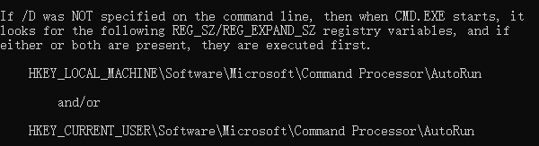

# 别名设置

## 创建使用

创建别名执行脚本, 如:

```powershell
@doskey clear=cls $*
@doskey ls=dir $*
```

解释：`doskey` 就相当于 `Linux` 中的 `alias`，`=` 左边是其右边的别名，`$*` 表示这个命令还可能有其他参数，`@` 表示执行这条命令时不显示这条命令本身

打开 `cmd`，输入 `cmd /?`来找到 `autorun` 的注册表项，你大概看到的也是这样的(所以这一步基本上可以跳过, 如果在本机中找不到以下注册表的话使用这种方法查找)




打开注册表 `regedit`

找到 `计算机\HKEY_LOCAL_MACHINE\SOFTWARE\Microsoft\Command Processor` 或者本机的注册表地址

新建或更改 `字符串值`: `AutoRun` 或 本机命令名称

修改其内容为 `别名执行脚本` 的路径


重新打开 `cmd` 即可使用

**[感谢原创: 在cmd中为命令设置别名以及启动cmd时自动执行bat](https://www.cnblogs.com/fstang/archive/2013/04/06/3002006.html)**

## 联动其他的脚本

联动其他的脚本, 如

```powershell
@doskey run_bing=D:\XXX\run.bat
```

`run.bat` 脚本的模板:

```powershell
@echo off
::切换执行环境编码为UTF-8
@chcp 65001
::获取=> 环境路径
set execute_environment_path=%cd%
::切换=> 当前脚本文件路径
cd /d %~dp0
::获取=> 当前脚本文件路径
set script_file_path=%cd%

echo 在这里执行需要执行的命令逻辑
echo 在这里执行需要执行的命令逻辑
echo 在这里执行需要执行的命令逻辑

::切换=> 环境路径
cd /d %execute_environment_path%
::判断=> 当前脚本文件路径==环境路径 执行用户等待命令
if %execute_environment_path%==%script_file_path% TIMEOUT /T -1
```

避免了因为执行路径的问题而导致的错误
