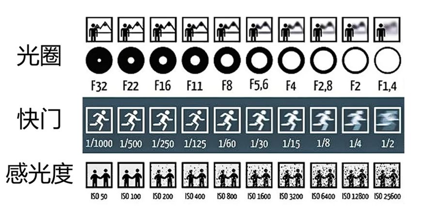

# 曝光三要素

光圈 $(F)$: 控制进光量的装置

快门 $(1/x)$: 接收光线的时间

感光度 $(ISO)$: 感光器件对光线的敏感程度

总结图表和表示:

## 快门

白话理解: 拍照机器的"门" 一开一关之间进入光线的多少

数值规律:
* **数值越小**: $1/8, 1/15, 1/30, ...$s
  * 表示开关的**时间越小, 越快**
  * 那么自然表示进入的**光线越少**
  * 自然表现出来的画面**亮度越暗**
* **数值越大**: $..., 1/250, 1/500, 1/1000, ...$s
  * 表示开关的**时间越大, 越慢**
  * 那么自然表示进入的**光线越多**
  * 自然表现出来的画面**亮度越亮**

动态模糊的推理思考: 当一个物体运动的时候, 并且再快门的开关时间方位内, 那拍出来的照片是什么样的?

回答: 因为运动会导致, 主体反射的光线, 进入画面的位置不同, 就会导致画面的模糊

如果物体运动的速度恒定, 快门开关的**速度越快**, 那么捕捉到的画面运动的**轨迹就越少**, 自然**画面更清晰**

### 总结特性

1. 快门数值影响画面亮度
   * 数字小, 画面暗
   * 数字大, 画面亮
2. 快门数值影响画面的动态模糊
   * 数字小, 轨迹清晰
   * 数字大, 轨迹模糊

### 经验记录

安全开门:
* 保证画面清晰的最低快门速度: (拍摄正常速度的物体运动)
* 数值得出: 使用相机镜头的焦距数值的倒数
  * 焦距数值为 49mm, 则安全开门设置为: $1/49$s

高速开门:
* 数值: $1/2000$s
* 清晰凝固高度运动的物体
* 缺点: 画面亮度降低, 需要再强光下使用

低速快门:
* 数值: $1/15$s, $1/60$s, $5-10$s
* 画面会变亮
* 运动的物体会留下运动轨迹, 也就是变的模糊
* 同时注意一定要使用三脚架之类固定相机位置, 防止抖动, 不然轨迹是一团麻

常用题材与数值:
* 人文题材 - 没有大动作: $1/125$s
* 人文题材 - 行人/跑动的小韩: $1/500$s
* 体育运动/飞鸟/动物奔跑/水花飞溅等高速运动: $1/1000$s
* 定格瞬间: $1/2000$s

快门优先档位: TV档/S档

## 光圈 F

白话理解: 光线进入相机的范围大小 (同一时间进入的多少)
* 好比大坝开闸, 多开了几个闸口, 流出的水就更多了

依据原理推理结论自然可知:
* 数值越大, 光圈越小, 画面越暗
* 数值越小, 光圈越大, 画面越亮
* 这里是数值格式是: $F/2.8, F/5.6$ 是不看$F/$的
* 如果理解成 $\frac{F}{2.8}$的话, 那反而是数值小光圈小, 数值大光圈大

其次还影响的一个因素是: 景深
* 依据课程的理解说明是: 背景的虚化程度
* 体现再照片上的效果就是, 焦点的主体是清晰的, 而其他的背景部分是模糊的
* 模糊程度取决于光圈的设置
* $F/2.8$ 背景非常模糊
* $F/8$ 背景有些模糊
* $F/22$ 背景也很清晰

当使用大光圈拍摄时可能引发的现象: 跑焦
* 跑焦: 光圈太大导致焦点位置发生偏移
* 解决办法: 使用最大光圈以下的一个或两个档位

注意: 要按照场景理解需选择光圈
* 有些场景需要突出主体, 背景不重要, 可以选择大光圈
* 但有些场景不能, 例如拍摄一个僧人扫地, 就需要把后面的寺庙背景也清晰的包含再画面中, 不然就成了摆拍, 照片就没有了灵魂

### 经验记录

参数数值:
* 需要虚化背景($F/2.8$): 突出静物或者人物主体, 使用大光圈
* 需要虚化背景($F/5.6$): 人文纪实, 主体突出, 保留一定的背景层次
* 需要全局清晰($F/11$): 风光, 产品, 商业人像, 必须清晰
* 大光圈: 突出主体
* 小光圈: 表现大环境
* 特殊情况: 只需要画质
  * 最佳画质光圈: 使用的镜头的最大光圈向下取第二/三个档位
  * 例如光圈范围: $F/\{2.8, 4, 5.6, 8, 11, 16, 22\}$
  * 最佳光圈就是: $F/8$

光圈优先档位: AV/A档
* 直接调节光圈, 其他的快门和ISO由相机自动调节
* 一般适用于: 日常人像/静物拍摄
* 不适合运动物体拍摄, 因为无法精准配置快门

## 感光度 ISO

白话理解: 除了外部光线之外, 可以通过调整相机内部的"模拟"光线, 这就是调整ISO

依据原理推理结论自然可知:
* 数值越大, 画面越亮
* 数值越小, 画面越暗 (最暗也不过说是外部光线的亮度而已)

延伸的问题是: 数字小就表示不通过相机增加光线, 只用外部光线, 那如果数字大了会怎么样?

回答: 数字大了, 首先照片亮度会变亮, 其次因为是相机自己给照片补的光, 但这个光并不真实, 补多了就会破坏原有照片结构形成: 噪点, 这样就会影响画面质量

噪点: 一种类似于原始胶片质感的"白点"

### 总结特性

1. 感光度数值影响画面亮度
   * 数字小, 画面暗
   * 数字大, 画面亮
2. 感光度数值影响画面质量
   * 数字小, 画面质量高清晰
   * 数字大, 画面质量差模糊

### 经验记录

参数数值:
* 环境亮度充足: 室外光线充足, 太阳天: ISO 100
* 环境亮度一般: 阴天, 树荫, 室内光线一般: ISO 200-320
* 环境亮度较弱: 清晨, 傍晚, 夜景, 室内: ISO 640-800

特殊情况: 当环境亮度很暗时的调整取舍:
* 还想拍好, 既要亮度, 还要确保画面质量, 那就外界补光
* 拍到比拍好重要, 例如偷拍明星, 这时候没法补光, 那就不在乎画面质量了, 拍到照片能分辨就行
