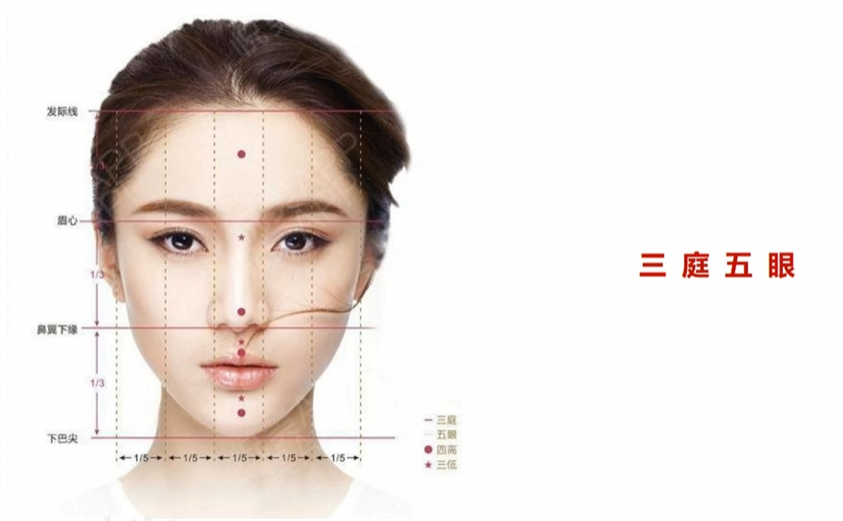

# 机位

简而言之 相机的位置 相机与模特的**三维**位置

* 高度
  * 平视机位
  * 高机位
  * 低机位
* 角度
  * 正面
  * 侧面
  * 背面
* 距离 (以取景范围评判)
  * 远 (远景拍摄) 人物占比小, 用于交代事发场景
  * 全 (全景拍摄) 人物的周边(上下左右) 离镜框比较接近 整个画面人物占比大 一般用来表现人物肢体语言
  * 中 (中景) 指拍到人物的膝盖以上以及胸部以下, 通常用来做交流对话镜头
  * 近 (近景) 指拍到模特的胸部以上, 以及肩膀以下
  * 特 : 指拍到模特的肩膀以上或面部细节特征, 主要用来增加事物重要性, 暗示紧张意义

## 平视机位

标准平视机位的掌控: 相机与相机取景框中的中心对焦点持平

### 优势

1. 相较于高低机位拍摄, 更具一定的**真实感** : 证件照, 肖像照, 人文纪实
2. 可以做到传情达意, 突出人物情绪 近景 特写
   1. 注意配合角度和举例重点强调核心表达

### 劣势

平平无奇

不拍:
* 远景, 无法通过人物表情传达情绪, 环境部分太太突出
* 全景: 例如拍摄人体全身照, 使用低机位, 突出大长腿
* 中景: 容易拍的模特脸胖, 使用高机位拍摄可以避免

### 进一步拔高平视机位拍摄水平

平时机位 - 选择 高低15° 用于强化镜头语言

1. 拍摄风格-甜美抬高, 欧美高冷风偏低
2. 人物情绪-开怀大笑-小孩偏高-站在家长的角度找共鸣

(记得多维度思考不同角度)

规避:

近大远小

人物五官-标准三庭五眼

